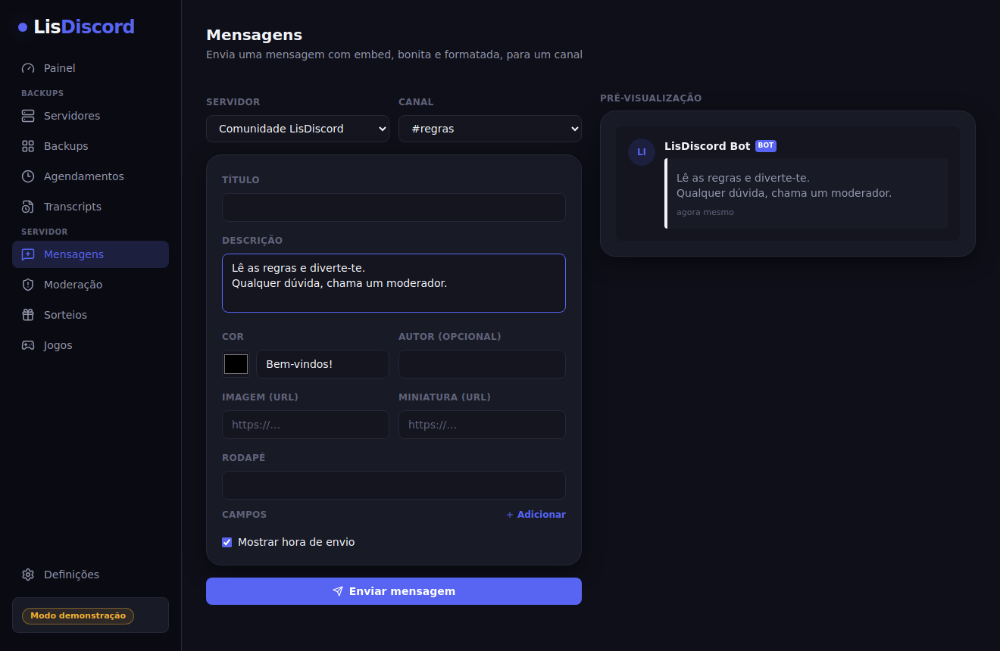
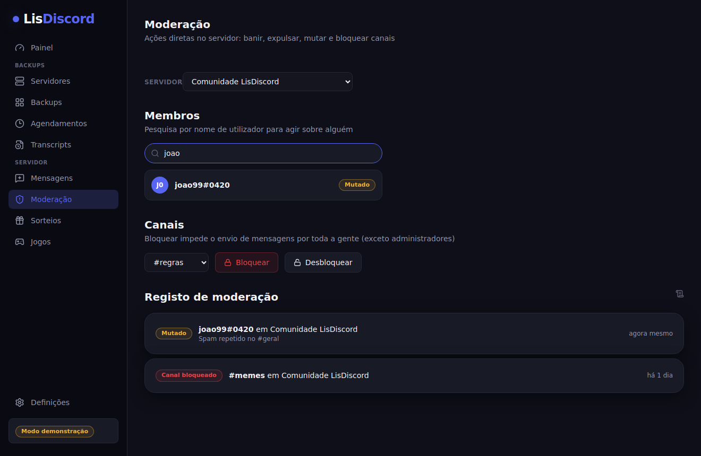
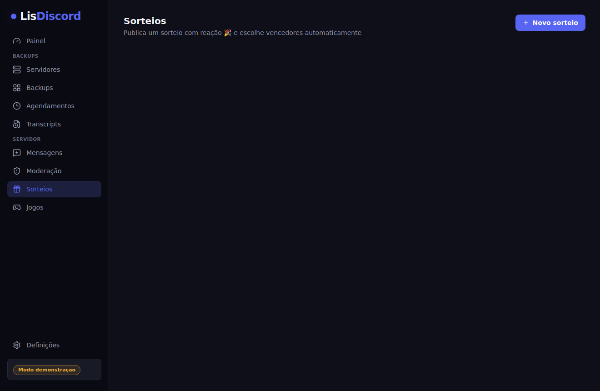
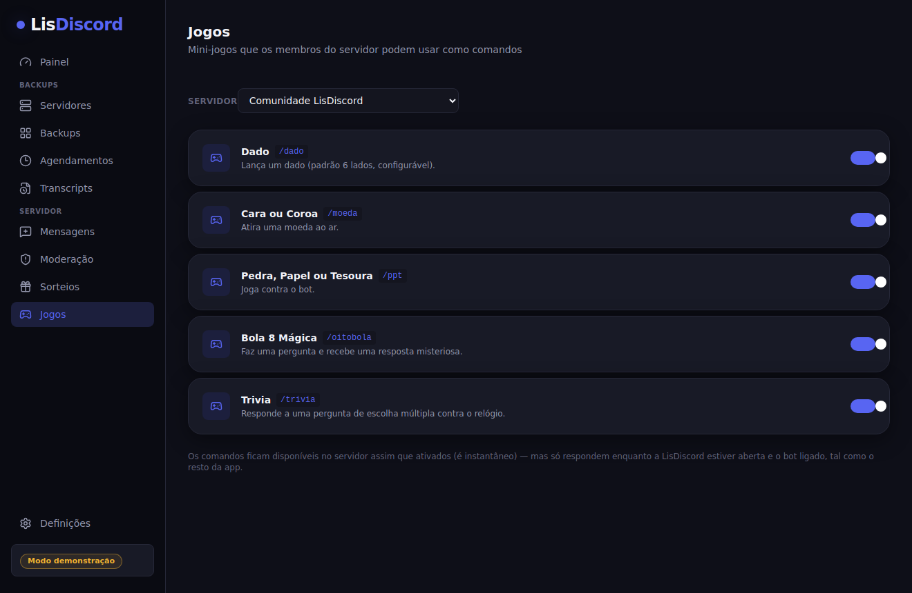

# LisDiscord - feito por Thiago Souza (é nois)

App desktop para **gerir servidores Discord** — backups, restauro, moderação, mensagens, sorteios e mini-jogos — tudo a correr no teu computador, com o teu próprio bot. Sem hospedagem, sem servidor externo, sem conta a criar: os dados ficam só na tua máquina.


## Como obter

**Executável pronto (recomendado)** — vai a [Releases](https://github.com/thiagodanjos/lisdiscord/releases) e descarrega a versão para o teu sistema (Windows `.exe`, macOS `.dmg` ou Linux `.AppImage`). Não precisas de Node, nem de instalar nada.

**A partir do código:**

```bash
git clone https://github.com/thiagodanjos/lisdiscord.git
cd lisdiscord
npm install
npm run dev
```

Isto abre a app já em modo demonstração — dá para navegar tudo sem preparar nada.

**Queres o bot online 24/7, sem depender do teu computador estar ligado?** Há um bot autónomo (`server/`) que corre sem Electron nem interface, pronto a pôr num servidor grátis com Docker — dois guias à escolha: **[Oracle Cloud Always Free](docs/deploy-oracle.md)** (máquina maior, mas por vezes sem capacidade disponível) ou **[Google Cloud Always Free](docs/deploy-gcp.md)** (máquina mais pequena, mas quase sempre disponível na hora).

## O que é (e o que não é)

O LisDiscord usa um **bot** que tu próprio crias e adicionas aos teus servidores — nunca uma conta de utilizador automatizada. Só consegue aceder ao que um bot normal consegue: estrutura do servidor, mensagens de canais onde está presente (com a Message Content Intent ativada) e ações de moderação para as quais lhe deste permissão. Não mexe em DMs nem em servidores onde não foi convidado, e não faz nada sem seres tu a pedir.

## Funcionalidades

**Backups**
- Backup completo — cargos, canais e categorias (com permissões), emojis, definições do servidor e, opcionalmente, a lista de banidos
- Restauro seletivo — escolhe o que restaurar, para o mesmo servidor ou para outro onde o bot também seja admin, com um modo de segurança (limpar canais existentes é opcional e pede confirmação explícita)
- Agendamentos automáticos (6h, 12h, diário, semanal…) com limpeza dos backups mais antigos
- Comparar dois backups e ver exatamente o que mudou
- Transcripts — exporta o histórico de um canal em texto, só para arquivo; nunca é reenviado para o Discord

**Servidor**
- **Mensagens** — compositor de embeds com pré-visualização ao vivo (título, descrição, cor, imagem, campos, rodapé) para publicar mensagens bem formatadas num canal
- **Moderação** — pesquisar membros, banir, expulsar e mutar (timeout), bloquear/desbloquear canais, com registo de todas as ações
- **Sorteios** — publica um sorteio com reação 🎉, escolhe vencedores automaticamente quando termina (ou manualmente, a qualquer momento); além da app, `/sorteio` faz o mesmo diretamente no Discord, com um assistente por botões: escolhe o canal, depois escreve o título/prémio, a duração exata (ex: `1h30m`, `2d`, `45m`) e o número de vencedores. Depois de terminar, a mensagem de resultado tem sempre um botão **Rerolar vencedor(es)** — só quem pode gerir o servidor consegue usá-lo — que escolhe novo(s) vencedor(es) entre quem reagiu, excluindo quem já tinha ganho
- **Jogos** — ativa mini-jogos como comandos que os membros do servidor podem usar, todos por botões (sem escrever comandos extra no chat): clássicos rápidos (`/dado`, `/moeda`, `/ppt`, `/oitobola`), `/trivia` com 24 perguntas em 6 categorias, `/forca` (adivinha a palavra letra a letra, escolhendo cada letra numa janela própria), `/blackjack` (21 contra a casa, com aposta), `/jogodavelha` (galo por turnos entre dois membros), `/duelo` (combate por turnos com ataque, defesa e ataque especial, também com aposta), `/roleta` e `/caca-niqueis` (casino, com jackpot), `/corrida` (aposta em qual bicho vence uma corrida animada), `/numero` (adivinha um número secreto, quanto menos tentativas mais moedas) e `/desembaralhar` (desembaralha as letras e escreve a palavra certa antes dos outros)
- **Economia** — os jogos com recompensa alimentam um saldo de moedas por servidor; os membros consultam com `/saldo`, reclamam uma recompensa diária com `/diario` (com bónus por sequência) e veem o `/ranking` de quem tem mais moedas
- **Pontos de MOV. Call** — `/movcall` é um assistente guiado por botões: escolhe o tipo (Normal = 10 pontos, ou Temática/Outras MOVS = 15 pontos), depois escreve, diretamente no chat do canal, a lista de participantes — um membro por linha, por menção (@membro, mesmo sem escolher a sugestão do Discord), pelo nome/alcunha, ou pelo ID; a mensagem com a lista é apagada automaticamente assim que é processada. Se a lista não for percebida, mostra o erro com um botão para voltar atrás, e no fim apaga sozinho as mensagens do assistente. `/movhoras` atribui horas de Mov. Call a um membro (escolhido por um seletor) através de uma janela com campos de horas/minutos/segundos — as horas acumulam-se e aparecem ao lado dos pontos na tabela, como critério de desempate: quem tem mais pontos vem sempre primeiro, e só entre pessoas com os mesmos pontos (incluindo 0) é que desempata quem tem mais horas. Gere tudo manualmente com `/pontosmovadmin` (adicionar/remover pontos, definir o canal do painel) ou pela página **Pontos MOV** da app; `/pontosmov` deixa qualquer membro consultar os seus pontos ou o ranking; um painel fixo no canal escolhido mostra sempre a tabela atualizada, em tempo real, sempre que pontos ou horas mudam. `/resetmovcall` (com confirmação) apaga todos os pontos e horas do servidor de uma vez, deixando o placar vazio — o mesmo reset também está disponível como botão na página **Pontos MOV** da app, sempre manual e nunca automático

**Geral**
- Modo demonstração — explora a app inteira com dados fictícios, sem bot nem token nenhum

## Tecnologias

- [Electron](https://www.electronjs.org/) + [Vite](https://vite.dev/) ([vite-plugin-electron](https://github.com/electron-vite/vite-plugin-electron))
- [React 18](https://react.dev/) + [TypeScript](https://www.typescriptlang.org/)
- [discord.js v14](https://discord.js.org/)
- [Tailwind CSS v4](https://tailwindcss.com/)
- [node-cron](https://github.com/node-cron/node-cron) (agendamentos)
- [Zustand](https://zustand-demo.pmnd.rs/) (estado da interface)

### Para usar com um bot real

1. Cria uma aplicação em [discord.com/developers/applications](https://discord.com/developers/applications) e adiciona um Bot.
2. Em **Bot → Privileged Gateway Intents**, ativa a **Message Content Intent** — necessária para o `/movcall` conseguir ler a lista de participantes no chat, e também para exportar transcripts.
3. Em **OAuth2 → URL Generator**, marca o scope `bot`, mais o scope `applications.commands` (para os mini-jogos), e a permissão `Administrator` (ou as permissões específicas de que precisas) — usa o link gerado para convidar o bot para o teu servidor.
4. Copia o token do bot e cola-o no ecrã inicial da app.

O token fica guardado encriptado localmente (via `safeStorage` do Electron) — nunca é enviado para lado nenhum a não ser para a própria API da Discord.

Os comandos `/movcall`, `/movhoras`, `/pontosmovadmin`, `/resetmovcall` e `/sorteio` só aparecem, por omissão, para membros com a permissão **Gerir servidor** — ajustável em **Definições do servidor → Integrações** no Discord. `/pontosmov` (ver pontos e ranking) fica disponível para toda a gente.

## Capturas de ecrã

<table>
  <tr>
    <td></td>
    <td></td>
  </tr>
  <tr>
    <td></td>
    <td></td>
  </tr>
  <tr>
    <td></td>
    <td></td>
  </tr>
</table>

## Scripts

```bash
npm run dev             # app em modo desenvolvimento (Vite + Electron)
npm run lint             # ESLint
npm run build             # build de produção + instalador (electron-builder)
npm run build:unpacked  # build de produção sem gerar instalador
npm run bot               # bot autónomo, sem Electron (precisa de DISCORD_TOKEN no ambiente)
npm run bot:dev           # o mesmo, mas reinicia sozinho quando o código muda
```

Os executáveis para Windows, macOS e Linux são construídos automaticamente por GitHub Actions a cada versão (ver `.github/workflows/release.yml`) e publicados em [Releases](https://github.com/thiagodanjos/lisdiscord/releases).

## Estrutura

```
electron/
├── main.ts           # arranque da app, janela, bootstrap
├── preload.ts         # contextBridge — a única ponte entre a UI e o Node
├── discord/            # tudo o que fala com a API da Discord (discord.js)
│   ├── client.ts        # ligar/desligar o bot, slash commands, interações
│   ├── backup.ts         # construir um backup a partir de um servidor
│   ├── restore.ts         # aplicar um backup a um servidor
│   ├── diff.ts             # comparar dois backups
│   ├── transcript.ts       # exportar histórico de um canal
│   ├── messaging.ts         # enviar mensagens com embed
│   ├── moderation.ts         # banir, expulsar, mutar, bloquear canais
│   ├── giveaways.ts           # publicar e concluir sorteios
│   ├── giveawayCommand.ts      # /sorteio — assistente por botões + modal, usa giveaways.ts
│   ├── games/                  # slash commands dos mini-jogos (um módulo por jogo) + economia
│   └── movcall.ts              # /movcall, /movhoras, /pontosmov, /pontosmovadmin, /resetmovcall e o painel de pontos em tempo real
├── store/               # persistência local (JSON em disco, token encriptado)
└── ipc/                  # liga os pedidos da interface às funções acima

shared/
├── types.ts            # tipos partilhados entre o processo principal e a UI
└── ipc.ts                # contrato dos canais IPC

src/
├── components/          # AppShell, modais, pré-visualização de embeds
├── pages/                 # uma página por rota
├── lib/                    # bridge (IPC real vs. modo demonstração), formatação
└── store/                   # estado da interface (Zustand)

server/
└── index.ts             # bot autónomo — a mesma lógica de electron/discord e
                          # electron/store, sem Electron nem interface (ver
                          # docs/deploy-oracle.md)
```

Na raiz, `Dockerfile` e `docker-compose.yml` empacotam o `server/` para correr num servidor 24/7.

## Dados locais

Na app desktop, tudo fica na pasta de dados da app (acessível em Definições → Abrir pasta): backups em JSON, transcripts em JSON, agendamentos, sorteios, registo de moderação e o token do bot (encriptado). No bot autónomo (`server/`), os mesmos dados ficam em `LISDISCORD_DATA_DIR` (por omissão `./data`, ou a Docker volume `lisdiscord-data` ao correr com Docker Compose) e o token vem só da variável de ambiente `DISCORD_TOKEN`, nunca gravado em disco. Nada sai do teu computador ou servidor exceto os pedidos normais à API da Discord.

## Autor

**Thiago Souza** — [github.com/thiagodanjos](https://github.com/thiagodanjos)

## Licença

Distribuído sob a licença MIT — ver [LICENSE](LICENSE).
