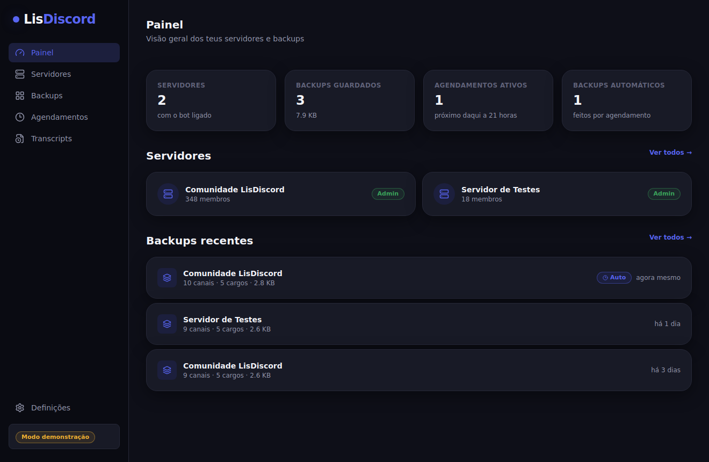
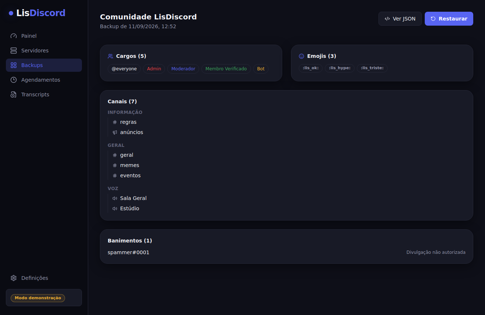
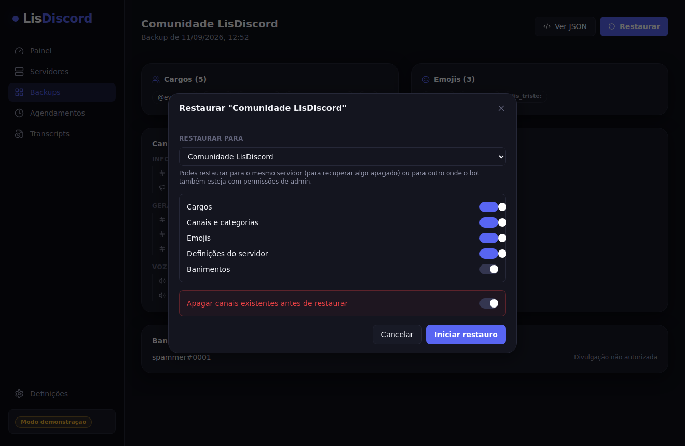
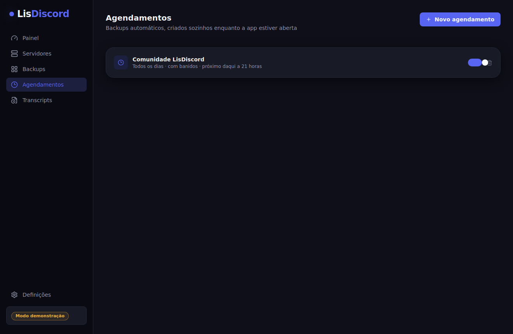
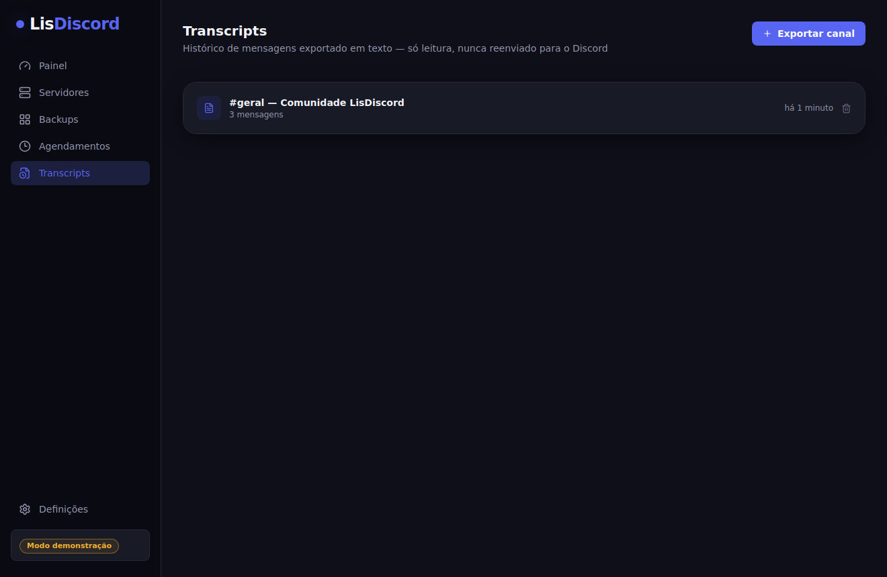

# LisDiscord - feito por Thiago Souza (é nois)

App desktop para fazer **backup, restauro e gestão de servidores Discord** — corre inteiramente no teu computador, com o teu próprio bot. Sem hospedagem, sem servidor externo, sem conta a criar: os dados ficam só na tua máquina.



## O que é (e o que não é)

O LisDiscord usa um **bot** que tu próprio crias e adicionas aos teus servidores — nunca uma conta de utilizador automatizada. Só consegue aceder ao que um bot normal consegue: estrutura do servidor (canais, cargos, permissões, emojis, definições) e histórico de mensagens de canais onde está presente, com a Message Content Intent ativada. Não mexe em DMs nem em servidores onde não foi convidado, e não faz nada sem seres tu a pedir.

## Funcionalidades

- **Backup completo** — cargos, canais e categorias (com permissões), emojis, definições do servidor e, opcionalmente, a lista de banidos
- **Restauro seletivo** — escolhe o que restaurar (cargos / canais / emojis / definições / banidos), para o mesmo servidor ou para outro onde o bot também seja admin
- **Modo de segurança no restauro** — apagar os canais existentes primeiro é opcional, desligado por omissão, e exige confirmação explícita
- **Agendamentos automáticos** — backups periódicos (6h, 12h, diário, semanal…) enquanto a app estiver aberta, com limpeza automática dos mais antigos
- **Comparar backups** — vê exatamente o que mudou (cargos/canais/emojis adicionados, removidos ou alterados) entre dois backups
- **Transcripts** — exporta o histórico de um canal em texto, só para arquivo/consulta; nunca é reenviado para o Discord
- **Modo demonstração** — explora a app inteira com dados fictícios, sem bot nem token nenhum

## Tecnologias

- [Electron](https://www.electronjs.org/) + [Vite](https://vite.dev/) ([vite-plugin-electron](https://github.com/electron-vite/vite-plugin-electron))
- [React 18](https://react.dev/) + [TypeScript](https://www.typescriptlang.org/)
- [discord.js v14](https://discord.js.org/)
- [Tailwind CSS v4](https://tailwindcss.com/)
- [node-cron](https://github.com/node-cron/node-cron) (agendamentos)
- [Zustand](https://zustand-demo.pmnd.rs/) (estado da interface)

## Como correr

```bash
git clone https://github.com/thiagodanjos/lisdiscord.git
cd lisdiscord
npm install
npm run dev
```

Isto abre a app já em modo demonstração — dá para navegar tudo sem preparar nada.

### Para usar com um bot real

1. Cria uma aplicação em [discord.com/developers/applications](https://discord.com/developers/applications) e adiciona um Bot.
2. Em **Bot → Privileged Gateway Intents**, ativa a **Message Content Intent** (só é preciso se quiseres exportar transcripts).
3. Em **OAuth2 → URL Generator**, marca o scope `bot` e a permissão `Administrator` (ou as permissões específicas de que precisas) e usa o link gerado para convidar o bot para o teu servidor.
4. Copia o token do bot e cola-o no ecrã inicial da app.

O token fica guardado encriptado localmente (via `safeStorage` do Electron) — nunca é enviado para lado nenhum a não ser para a própria API da Discord.

## Capturas de ecrã

<table>
  <tr>
    <td></td>
    <td></td>
  </tr>
  <tr>
    <td></td>
    <td></td>
  </tr>
</table>

## Scripts

```bash
npm run dev             # app em modo desenvolvimento (Vite + Electron)
npm run lint             # ESLint
npm run build             # build de produção + instalador (electron-builder)
npm run build:unpacked  # build de produção sem gerar instalador
```

## Estrutura

```
electron/
├── main.ts           # arranque da app, janela, bootstrap
├── preload.ts         # contextBridge — a única ponte entre a UI e o Node
├── discord/            # tudo o que fala com a API da Discord (discord.js)
│   ├── client.ts        # ligar/desligar o bot
│   ├── backup.ts         # construir um backup a partir de um servidor
│   ├── restore.ts         # aplicar um backup a um servidor
│   ├── diff.ts             # comparar dois backups
│   └── transcript.ts       # exportar histórico de um canal
├── store/               # persistência local (JSON em disco, token encriptado)
└── ipc/                  # liga os pedidos da interface às funções acima

shared/
├── types.ts            # tipos partilhados entre o processo principal e a UI
└── ipc.ts                # contrato dos canais IPC

src/
├── components/          # AppShell, modais, UI reutilizável
├── pages/                 # uma página por rota
├── lib/                    # bridge (IPC real vs. modo demonstração), formatação
└── store/                   # estado da interface (Zustand)
```

## Dados locais

Tudo fica na pasta de dados da app (acessível em Definições → Abrir pasta): backups em JSON, transcripts em JSON, agendamentos e o token do bot (encriptado). Nada sai do teu computador exceto os pedidos normais à API da Discord.

## Autor

**Thiago Souza** — [github.com/thiagodanjos](https://github.com/thiagodanjos)

## Licença

Distribuído sob a licença MIT — ver [LICENSE](LICENSE).
