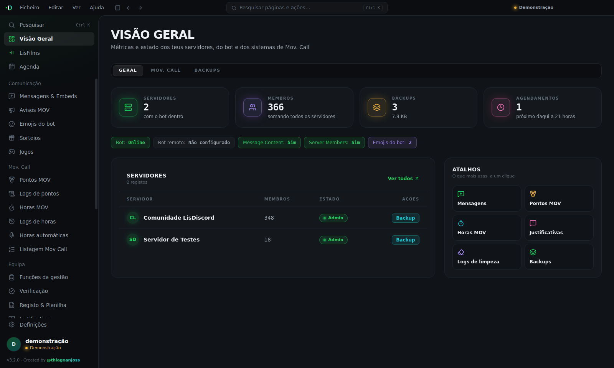
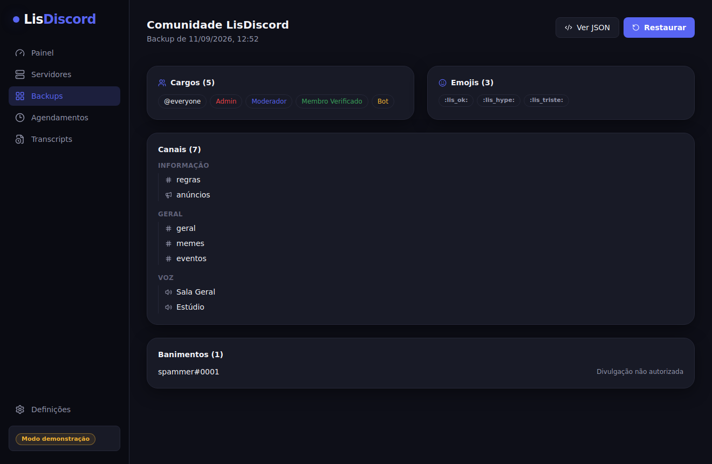
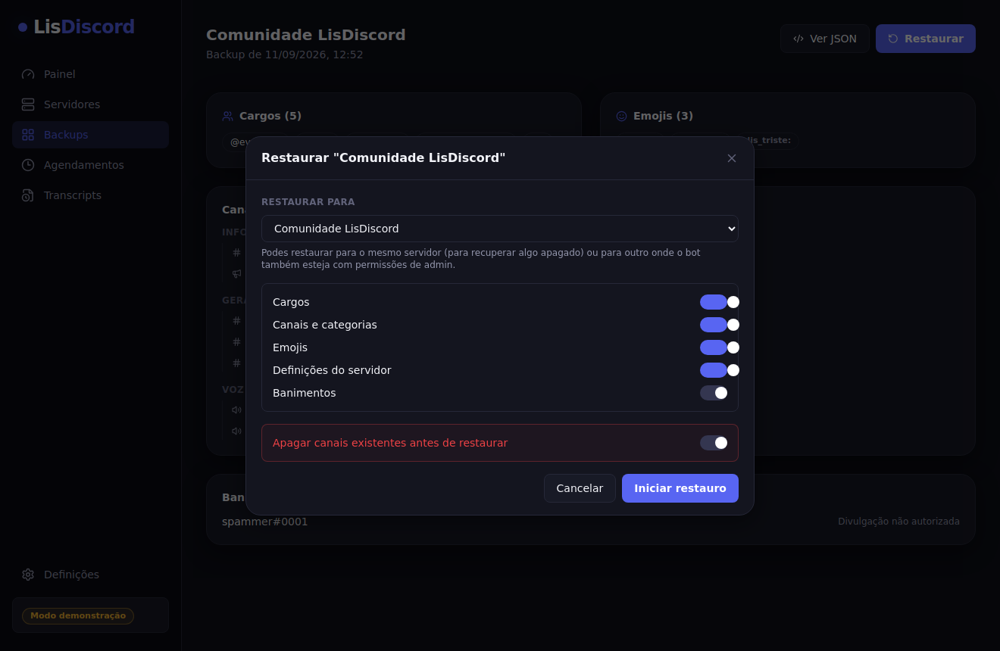
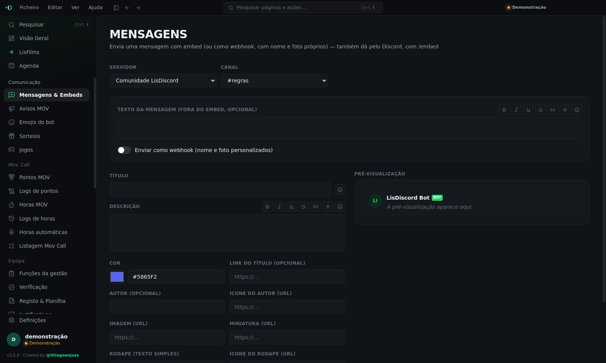
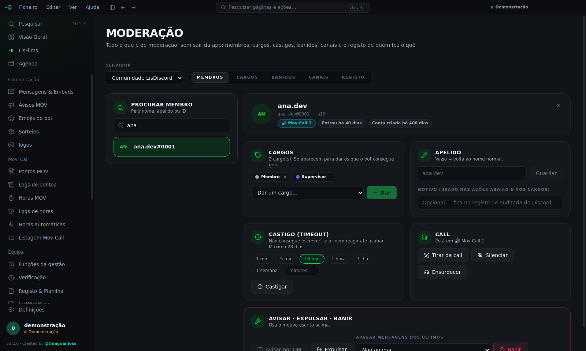
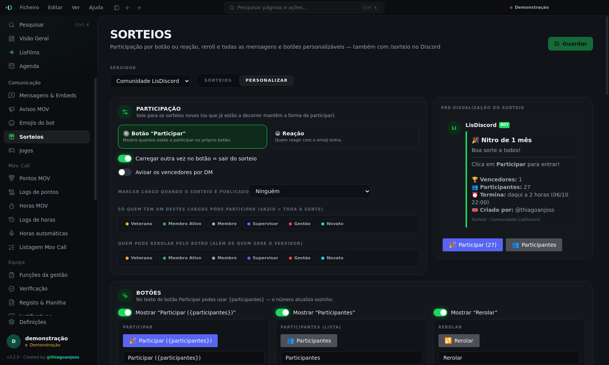
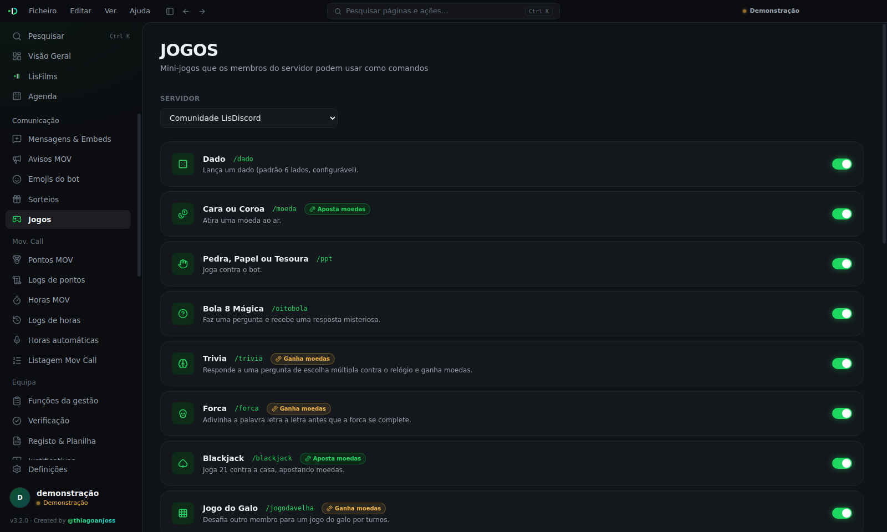

# LisDiscord - feito por Thiago Souza (é nois)

App desktop para **gerir servidores Discord** — backups, restauro, moderação, mensagens, sorteios e mini-jogos — tudo a correr no teu computador, com o teu próprio bot. Sem hospedagem, sem servidor externo, sem conta a criar: os dados ficam só na tua máquina.



## Como obter

**Executável pronto (recomendado)** — vai a [Releases](https://github.com/thiagodanjos/lisdiscord/releases) e descarrega a versão para o teu sistema (Windows `.exe`, macOS `.dmg` ou Linux `.AppImage`). Não precisas de Node, nem de instalar nada.

**A partir do código:**

```bash
git clone https://github.com/thiagodanjos/lisdiscord.git
cd lisdiscord
npm install
npm run dev
```

Isto abre a app já em modo demonstração — dá para navegar tudo sem preparar nada.

**Queres o bot online 24/7, sem depender do teu computador estar ligado?** Há um bot autónomo (`server/`) que corre sem Electron nem interface, pronto a pôr num servidor grátis com Docker — dois guias à escolha: **[Oracle Cloud Always Free](docs/deploy-oracle.md)** (máquina maior, mas por vezes sem capacidade disponível) ou **[Google Cloud Always Free](docs/deploy-gcp.md)** (máquina mais pequena, mas quase sempre disponível na hora).

## Novidades da 3.1

- **3.1.1** — o assistente do `/sorteio` também é personalizável na app (Sorteios → Personalizar → Assistente do /sorteio): os embeds de cada passo, o menu de canais, os botões Escrever detalhes / Voltar / **Cancelar**, o formulário (título, campos e exemplos), os erros e a mensagem de sorteio criado.

- **Moderação completa na app** — procura um membro (nome ou ID) e dá/tira cargos, muda o apelido, castiga (timeout), tira da call, silencia/ensurdece, avisa por DM, expulsa ou bane. Separadores para **Cargos** (criar, editar cor/nome, apagar, dar/tirar cargo em massa), **Banidos** (lista, desbanir, banir por ID), **Canais** (bloquear, modo lento, apagar mensagens) e o **Registo** com quem fez o quê. Funciona com o bot remoto.
- **Tirar o bot de um servidor** — em Servidores, com confirmação pelo nome do servidor.
- **Sorteios remodelados** — participar por **botão** (com o número de participantes no botão) ou por reação; cargo exigido para participar; quem pode rerolar; DM aos vencedores. As 6 mensagens (sorteio, fim, vencedores, **reroll**, sem participantes, DM) podem ir **em embed ou só em texto**, com embed, botões e respostas totalmente personalizáveis.
- **Agenda: dono da mov + supervisores** — antes de cada mov o bot pergunta por DM ao dono se vai conseguir. Se não puder (ou não responder, ou não houver dono), manda DM a todos os supervisores (e, se quiseres, uma mensagem geral num canal). O primeiro a carregar em **Eu assumo** fica com a mov e todas as mensagens mudam para "assumida por …". Tempos, cargos, categorias, botões, textos e as 6 mensagens são personalizáveis.
- **Funções da gestão** — painel num canal com quem cuida de cada função (pessoas ou cargos, com divisões por dia), em texto simples ou embed, com botões configuráveis (**Quem cuida de quê**, **As minhas funções**, links, mensagens próprias) e um menu para ver cada função em detalhe. Já vem com as 12 funções da gestão.

## Novidades da 3.0

- **Visual novo, mais uniforme** — sem a barra de título do Windows: a app desenha a sua (menus Ficheiro · Editar · Ver · Ajuda, voltar/avançar, mostrar/esconder a barra lateral) e os botões minimizar/maximizar/fechar nativos ficam por cima, nas cores da app (o "encaixar" do Windows 11 continua). Barra lateral ao estilo das apps desktop modernas, com modo compacto (Ctrl+B), **Recentes** e **pesquisa rápida** de qualquer página (Ctrl+K). Ecrã de arranque novo.
- **Logo novo** — o ponto, a barra e o "D" em verde → ciano, da mesma família do LisFilms (as mesmas cores: `#1ED760` e `#0b0d10`).
- **Aba LisFilms** — a página do site com o **vídeo de apresentação**, o estado da ligação ao site (com os números da comunidade), uma pesquisa para experimentar e a configuração da integração.
- **`/lisfilms` no Discord** — `procurar` (filmes, séries, animes, jogos e pessoas, com menu para abrir cada resultado), `filme` / `serie` / `anime` (poster, sinopse, nota LisFilms ★ e TMDB, com autocompletar), `jogo` (LisGames: capa, plataformas, Metacritic, nota da casa), `top`, `resumo`, `destaque` e `utilizador`. Cada comando liga/desliga na app; embeds, botão para o site e textos personalizáveis. Lê a API pública do LisFilms (`lisfilms-api.onrender.com`) — sem contas nem chaves.

## O que é (e o que não é)

O LisDiscord usa um **bot** que tu próprio crias e adicionas aos teus servidores — nunca uma conta de utilizador automatizada. Só consegue aceder ao que um bot normal consegue: estrutura do servidor, mensagens de canais onde está presente (com a Message Content Intent ativada) e ações de moderação para as quais lhe deste permissão. Não mexe em DMs nem em servidores onde não foi convidado, e não faz nada sem seres tu a pedir.

## Funcionalidades

**App**
- **Conta local com login (SQLite)** — na primeira vez crias uma conta (utilizador + palavra-passe); o token do bot fica guardado nessa conta, encriptado pelo sistema operativo, e com **Manter sessão iniciada** a app entra e liga o bot sozinha ao abrir — nunca mais é preciso colar o token. As contas ficam numa base de dados SQLite (`lisdiscord.sqlite`) na pasta de dados da app; o repositório só tem o modelo (`electron/db/schema.sql`), nunca dados de ninguém. Em **Definições**: alterar a palavra-passe, ver as últimas entradas, esquecer o token e terminar sessão. Com um bot remoto configurado, dá para entrar sem ligar o bot localmente
- **Visual** — tema escuro néon com cartões de vidro, brilhos e animações; menu lateral organizado por categorias (Geral, Comunicação, Mov. Call · Pontos, Mov. Call · Horas, Equipa, Moderação & Limpeza, Backups, Sistema) que abrem e fecham; barra de topo com o caminho da página e o estado do bot em tempo real; **Visão Geral** com separadores (Geral, Mov. Call, Backups), cartões de estatísticas, top 5 e atividade recente

**Backups**
- Backup completo — cargos, canais e categorias (com permissões), emojis, definições do servidor e, opcionalmente, a lista de banidos
- Restauro seletivo — escolhe o que restaurar, para o mesmo servidor ou para outro onde o bot também seja admin, com um modo de segurança (limpar canais existentes é opcional e pede confirmação explícita)
- Agendamentos automáticos (6h, 12h, diário, semanal…) com limpeza dos backups mais antigos
- Comparar dois backups e ver exatamente o que mudou
- Transcripts — exporta o histórico de um canal em texto, só para arquivo; nunca é reenviado para o Discord

**Servidor**
- **Mensagens** — compositor de embeds com pré-visualização ao vivo (título, descrição, cor, imagem, campos, rodapé) para publicar mensagens bem formatadas num canal — com texto fora do embed, ícones de autor/rodapé, link no título e a opção de enviar **como webhook** (nome e foto personalizados); **Exportar JSON**/**Importar JSON** usam o formato da própria Discord (compatível com o Discohook e com o `/embed`). Tudo isto também existe pelo Discord, com **`/embed`**: um painel com pré-visualização ao vivo, um menu *Selecione uma opção para personalizar* (canal, conteúdo, título, descrição, cor, thumbnail, imagem, autor e ícone, rodapé e ícone, nome e ícone da webhook, campos, data/hora, exportar e importar configuração) e botões para enviar ou sair. A descrição e os campos têm uma barra de formatação (negrito, itálico, sublinhado, rasurado, link) que envolve o texto selecionado com o Markdown da Discord, tal como a própria Discord faz — e a pré-visualização já mostra tudo formatado (negrito a bold, links clicáveis, emojis do bot como imagem), não o texto cru com asteriscos. O mesmo editor é reutilizado nos templates de embed (placar de pontos, justificativas)
- **Moderação** — pesquisar membros, banir, expulsar e mutar (timeout), bloquear/desbloquear canais, com registo de todas as ações
- **Limpeza** — `/limparcdo quantidade: [membro:] [canal:]` apaga até 1000 mensagens de um canal (opcionalmente só as de um membro), só para quem tem **Administrador**; acima de 100 pede confirmação, nunca apaga mensagens fixadas e avisa das que têm mais de 14 dias (a Discord não deixa apagá-las em massa). Cada limpeza fica registada na página **Logs de limpeza** da app (quem, onde, quantas, filtro, quando), também com bot remoto
- **Sorteios** — publica um sorteio com reação 🎉, escolhe vencedores automaticamente quando termina (ou manualmente, a qualquer momento); além da app, `/sorteio` faz o mesmo diretamente no Discord, com um assistente por botões: escolhe o canal, depois escreve o título/prémio, a duração exata (ex: `1h30m`, `2d`, `45m`) e o número de vencedores. Depois de terminar, a mensagem de resultado tem sempre um botão **Rerolar vencedor(es)** — só quem pode gerir o servidor consegue usá-lo — que escolhe novo(s) vencedor(es) entre quem reagiu, excluindo quem já tinha ganho
- **Jogos** — ativa mini-jogos como comandos que os membros do servidor podem usar, todos por botões (sem escrever comandos extra no chat): clássicos rápidos (`/dado`, `/moeda`, `/ppt`, `/oitobola`), `/trivia` com 24 perguntas em 6 categorias, `/forca` (adivinha a palavra letra a letra, escolhendo cada letra numa janela própria), `/blackjack` (21 contra a casa, com aposta), `/jogodavelha` (galo por turnos entre dois membros), `/duelo` (combate por turnos com ataque, defesa e ataque especial, também com aposta), `/roleta` e `/caca-niqueis` (casino, com jackpot), `/corrida` (aposta em qual bicho vence uma corrida animada), `/numero` (adivinha um número secreto, quanto menos tentativas mais moedas) `/desembaralhar` (desembaralha as letras e escreve a palavra certa antes dos outros), `/termo` (adivinha a palavra de 5 letras em 6 tentativas, com 🟩🟨⬛ como no Wordle), `/minas` (campo minado com aposta — cada casa segura sobe o multiplicador, retira quando quiseres), `/crash` (o foguete sobe e o multiplicador também; retira antes de ele rebentar, ou define um `retirar_em` automático), `/memoria` (encontra os 8 pares de emojis, quanto menos jogadas mais moedas) e `/ship` (compatibilidade entre dois membros, sempre o mesmo resultado para o mesmo par). Os clássicos também ficaram melhores: `/dado` lança até 10 dados de uma vez, `/moeda` aceita uma aposta (dobro ou nada) e `/ppt`/`/oitobola` respondem com embeds. Jogos novos ficam ativos sozinhos em servidores que já tinham configurações guardadas
- **Economia** — os jogos com recompensa alimentam um saldo de moedas por servidor; os membros consultam com `/saldo`, reclamam uma recompensa diária com `/diario` (com bónus por sequência) e veem o `/ranking` de quem tem mais moedas
- **Pontos de MOV. Call** — `/movcall` é um assistente guiado por botões: escolhe o tipo (Normal = 10 pontos, ou Temática/Outras MOVS = 15 pontos), depois clica em **Escrever lista** para colar os participantes numa janela, um **ID** por linha (o Discord não permite escrever menções dentro de uma janela deste tipo, só IDs — a própria janela avisa disto e explica como copiar o ID de alguém). Se a lista não for percebida, mostra o erro com um botão para voltar atrás, e no fim apaga sozinho as mensagens do assistente. Bots nunca recebem pontos. `/movhoras adicionar` e `/movhoras remover` (membro + horas/minutos/segundos, com um motivo opcional que fica no log) gerem as horas de Mov. Call — as horas acumulam-se e aparecem ao lado dos pontos na tabela, como critério de desempate: quem tem mais pontos vem sempre primeiro, e só entre pessoas com os mesmos pontos (incluindo 0) é que desempata quem tem mais horas. Gere tudo manualmente com `/pontosmovadmin` (adicionar/remover pontos, definir o canal do painel) ou pela página **Pontos MOV** da app; `/pontosmov` deixa qualquer membro consultar os seus pontos ou o ranking; um painel fixo no canal escolhido mostra sempre a tabela atualizada, em tempo real, sempre que pontos ou horas mudam — todos os placares mostram uma menção (@membro) em vez de só o nome, para ser fácil de identificar quem é. O ranking (painel, `/pontosmov ranking` e a página **Pontos MOV** da app) mostra sempre **todos** os membros do servidor, mesmo quem nunca teve pontos ou horas — exceto bots, e exceto quem escondas manualmente na página **Pontos MOV** da app (um ícone de olho fechado por pessoa, reversível a qualquer momento). `/inativos` (visível para todos) mostra quem não tem pontos ou tem menos de 5 horas de Mov. Call, no mesmo formato. `/resetmovcall` (com confirmação) apaga todos os pontos e horas do servidor de uma vez, deixando o placar vazio — o mesmo reset também está disponível como botão na página **Pontos MOV** da app, sempre manual e nunca automático
- **Horas MOV** — página própria para as horas: estatísticas do servidor, todos os membros ordenados por horas (com barra de progresso e aviso de quem está abaixo de 5h) e uma janela **Ajustar** para adicionar ou remover horas, com atalhos (+15m, +30m, +1h, +2h) e o total que fica depois de cada opção
- **Logs de pontos** e **Logs de horas** — cada alteração (por comando do Discord ou pela app) fica registada: quem fez, a quem, quanto, o saldo resultante e uma nota de contexto; pontos e horas têm cada um o seu histórico (a reposição do placar aparece nos dois), mais recente primeiro
- **Justificativas** — escolhe, na página **Justificativas** da app, dois canais de publicação (um para justificativas **fixas**, um para **diárias**) e dois canais de log (o alarme para administradores, também separado por fixa/diária). Ao guardar um canal de publicação, o bot publica logo lá a mensagem com as instruções e os botões **Justificar** / **Remover Justificativa**; mudar ou limpar um canal apaga automaticamente a mensagem antiga, para nunca ficar um botão órfão a funcionar num sítio que já não está configurado. Justificar abre um assistente: confirma que a justificativa é para ti próprio(a), escreve o período (nas fixas, dias da semana + horário, ex. `Segunda à sexta - 14:00 até 18:00`; nas diárias, só o horário de hoje) e o motivo, revê tudo e confirma — a mensagem final, bem formatada e com o teu nome no rodapé, é publicada ali mesmo no canal de justificativas; o canal de log correspondente (fixa → log de fixas, diária → log de diárias) só recebe um alarme resumido, com link direto para a mensagem, para avisar os administradores. Remover Justificativa pede o motivo da remoção e avisa o canal de log certo, para um administrador rever e remover manualmente. Se o bot corre 24/7 noutro sítio (ver "bot autónomo" abaixo), a secção **Bot remoto** desta página liga a app diretamente a ele — e a ligação local da app passa a ficar **passiva** (não responde a nada no Discord), para os dois nunca responderem ao mesmo clique — evita ter a app e o bot autónomo ligados à Discord ao mesmo tempo, o que faria cada um gravar a sua própria cópia das configurações. Essa mesma ligação (configurada uma única vez em Justificativas) aplica-se automaticamente às páginas **Pontos MOV**, **Logs de pontos**, **Metas** e **Upamentos** — todas mostram um aviso "A usar o bot remoto" quando ativa, e passam a ler e escrever sempre nos dados do bot que está mesmo a correr, nunca numa cópia local separada
- **Avisos MOV** — `/avisomov canal: tempo: [mensagem:] [marcar:] [repetir:]` (só gestores) agenda um aviso para um canal: o bot publica-o na hora certa (ex.: `30m`, `2h`, `1h30m`, `1d`), com um cargo marcado por cima se quiseres e, opcionalmente, a repetir todos os dias ou todas as semanas. Sem `mensagem`, abre uma janela para escrever com várias linhas; a confirmação tem um botão **Cancelar aviso**. A página **Avisos MOV** da app faz o mesmo com data e hora exatas, mostra os agendados (com botão para cancelar) e o histórico, e tem **Personalizar embed do aviso** — o visual de todos os avisos, com `{mensagem}`, `{autor}`, `{nomeAutor}`, `{avatarAutor}`, `{canal}`, `{cargo}` e `{servidor}`. Os avisos ficam gravados e sobrevivem a reinícios do bot
- **Verificação por ticket** — na página **Verificação** escolhes o canal do painel e o bot publica lá um embed (personalizável) com um botão **Verificar** (texto, emoji e cor à escolha). Ao clicar, o bot cria um **ticket**: um canal privado na categoria que escolheres (ex.: “Verifique-se”), com o nome que definires (`{usuario}`, `{id}`, `{numero}`), que só o membro, a gestão (cargos de aprovação) e o bot veem — com um embed de boas-vindas (personalizável) e um botão **Fechar ticket**. As respostas a quem clica em Verificar (“ticket criado”, “já tens um ticket”, “limite de tickets”) são embeds personalizáveis em formato caixa, com um botão **Ir para o ticket** (texto e emoji personalizáveis). Cada membro pode abrir no máximo **2 tickets por hora** (ajustável) e só um de cada vez; a gestão não tem limite. O ticket abre já com uma mensagem (personalizável, com `{responsavel}` e `{estado}` que se atualizam sozinhos) no formato novo de caixa da Discord, com os botões da gestão lá dentro — tal como o painel com o botão **Verificar**. Dentro do ticket, o membro manda o print do perfil com os cargos: o bot apaga a mensagem e publica a foto num embed próprio (personalizável). Os botões da gestão — **Assumir**, **Finalizar**, **Cancelar** e **Painel staff** (texto, emoji — normal ou da biblioteca do bot — e cor de cada um personalizáveis, tal como o botão **Verificar** do painel) — e marca o cargo da gestão numa mensagem simples; texto do membro é apagado com um aviso. Só **Administrador** ou os cargos de aprovação usam os botões. **Assumir** marca o gestor como responsável e abre-lhe um painel que só ele vê, para escolher os cargos do membro (dados na hora; só cargos abaixo do dele e do bot). **Finalizar** dá também os cargos automáticos configurados (e tira os configurados, ex.: @Novato), manda para o canal de log tudo o que aconteceu (responsável, quem fechou, cargos dados e tirados, duração e a foto) e fecha o ticket. **Cancelar** pede um motivo opcional, retira os cargos dados no painel e manda o log. Depois de alguém assumir, só essa pessoa (ou um administrador) finaliza ou cancela. O **{estado}** e o **{responsavel}** do ticket vêm de textos personalizáveis na app (com emojis do bot), um por fase — *aguardando print* → *aguardando verificador* (o membro mandou o print) → *verificando* (um gestor assumiu) → *verificado* / *cancelado* (fica visível na caixa até o ticket fechar) — tal como o texto de "Assumido por" (ninguém / `{gestor}`), o do botão depois de assumido e quantos segundos o ticket demora a ser apagado (5 s por omissão). O **painel staff** (a janela só do gestor, com o seletor de cargos e o botão Finalizar) também é uma caixa personalizável: embed (`{cargosEscolhidos}`, `{aoFinalizar}`, `{cargosDar}`, `{cargosTirar}`, `{finalizar}`, `{nota}`…), texto/emoji/cor do botão Finalizar, texto do seletor e todas as notas (cargos atualizados, recusados, falhados, membro saiu, já decidida). O aviso que aparece quando o membro escreve em vez de mandar o print (e o de imagem grande demais) também é uma caixa personalizável, com o tempo até desaparecer à escolha — e várias mensagens seguidas mostram um só aviso. **Anti-spam no ticket:** o ticket pode ser criado já com **modo lento** (5 s a 1 h; os tickets abertos passam a ter ao guardar) e há um **modo castigo** opcional — quem mandar N mensagens em X segundos no próprio ticket leva **castigo (timeout)** de Y minutos, com um aviso em caixa personalizável (precisa da permissão Castigar membros; a gestão nunca é afetada). O ticket avisa o resultado e é apagado passados 10 segundos. A página mostra um **Diagnóstico** ao vivo, os tickets abertos e o histórico
- **Barra divisória em qualquer embed** — todos os editores de texto da app têm um botão ☰ que insere `{barra}` numa linha: nas mensagens em formato caixa (painel e tickets da verificação, e as respostas ao botão Verificar) vira a linha divisória verdadeira da Discord; nos embeds normais vira uma linha fina em letra pequena. A pré-visualização mostra a barra, títulos (`#`, `##`, `###`) e texto pequeno (`-#`) tal como a Discord
- **Listagem de Mov Call** — página **Listagem Mov Call**: o bot publica no canal escolhido uma mensagem (caixa personalizável: título, cor hexadecimal, imagem, rodapé) com todos os membros de Mov Call numerados — `1. @membro - ID` (formato da linha personalizável: `{numero}`, `{mencao}`, `{id}`, `{nome}`, `{usuario}`) — e os botões **Add Membro**, **Remover membro** e **Copiar listagem** (texto, emoji normal ou do bot e cor de cada um; o campo hexadecimal escolhe a mais parecida das 4 cores que a Discord permite). Add/Remover abrem uma janela só para quem clicou, com um seletor de membros (até 25 de cada vez) ou **Por ID** (colar IDs/menções); **Copiar listagem** devolve a lista em texto (nomes e IDs, cabeçalho e linha personalizáveis), ou num `.txt` se for grande. Listas longas ganham páginas (◀ ▶). Só administradores, quem tem Gerir servidor e os cargos escolhidos mexem na lista (copiar pode ficar aberto a todos). Na app dá também para adicionar por nome/ID, importar todos de um cargo, reordenar e remover; todas as respostas são textos editáveis, e há um canal de log opcional de quem adicionou/removeu
- **Horas automáticas** — página própria: o bot conta sozinho o tempo de cada membro em call e soma às horas de Mov Call quando a pessoa sai (vai para o log de horas como qualquer outra alteração). Regras anti-fraude à escolha: só certas calls/categorias (ou todas menos algumas), só certos cargos, membros ignorados, mínimo de pessoas na call (sozinho não conta), sem contar quem está ensurdecido/mutado/mutado pela staff ou no canal AFK, sessão mínima e limite de horas por dia. Painel **ao vivo** com quem está em call e se está a contar (com "Creditar" e "Descartar"), histórico das sessões e canal de log com embed personalizável
- **/perfil** — cartão de cada membro (caixa personalizável): pontos, horas, posição no ranking, a semana, metas com **barras de progresso** (caracteres/emojis, tamanho e linha de cada meta à escolha) e se está em call agora. Botões **Atualizar**, **Ranking** e um **link** opcional, cada um com texto, emoji e cor; resposta pública ou só para quem usou; pode ou não ver o perfil de outros
- **Relatório semanal** — no dia, hora e fuso escolhidos, o bot publica o resumo do período: top pontos e top horas, inativos (limites à escolha), quem já cumpre a meta para upar, verificações aprovadas/canceladas, sessões em call. Embed, linhas, limites, cargo marcado, cargos considerados e botões (**Copiar relatório** em texto simples, **Ranking completo**, link) personalizáveis; na app há pré-visualização com os dados reais, **Enviar agora** e **Recomeçar período**
- **Agenda de atividades** — página **Agenda** com o calendário da semana em grelha (tipo planilha, com os **horários livres** de cada dia — clica para marcar), vista em **lista** com todas as colunas (data, hora, categoria, responsável, vagas de participantes e organizadores, indisponíveis, estado) e **filtros** por categoria, responsável, estado e texto. Cada atividade é publicada no canal da agenda (caixa personalizável, cor da categoria) com os botões **Confirmar presença**, **Indisponível**, **Quero organizar** e **Sair** (texto, emoji e cor à escolha); vagas esgotadas desligam o botão. **Lembretes automáticos** (até 5, ex.: 1h e 10 min antes — no canal, por DM ou nos dois), **conflitos de horário** bloqueados (mesmo responsável/local, ou qualquer sobreposição) e ninguém se inscreve em duas atividades à mesma hora. Painel fixo com a agenda dos próximos dias, categorias com emoji e cor, cargos de quem gere/organiza/participa, todos os textos e embeds personalizáveis. Comandos: `/atividade criar|editar|cancelar|listar|ver` (com autocompletar)
- **Canais de log** — página própria para escolher onde vão os registos: **mensagens apagadas** (todas as do servidor: conteúdo, autor, quem apagou — pelo registo de auditoria — e quando; apagamentos em massa aparecem resumidos), **mensagens editadas** (antes/depois, com link), **pontos** e **horas** de Mov. Call (cada alteração, por comando ou pela app, e as reposições do placar). Todos os embeds são personalizáveis, e dá para ignorar mensagens de bots
- **Upamentos** — define, na página **Metas** da app, quantos pontos e horas de Mov. Call cada cargo exige para ser promovido; na página **Upamentos**, escolhe um membro para ver os cargos, pontos e horas dele, e escolhe um dos cargos dele para veres logo se já cumpre a meta (🟢 ✅ pode upar, ou 🔴 ❌ ainda não) — tudo só na app. No Discord, `/verificar @membro` mostra os pontos, as horas e **só os cargos do membro que têm meta configurada** (cargos sem meta não aparecem), com ✅/❌ para cada um. O embed é todo personalizável em **Upamentos → Personalizar /verificar**, incluindo a linha de cada cargo (meta cumprida / por cumprir) com `{cargo}`, `{cargoNome}`, `{pontos}`, `{metaPontos}`, `{horas}`, `{metaHoras}`, `{faltamPontos}` e `{faltamHoras}`
- **Ajuda** — `/help` abre um painel com um menu por categoria (Mov. Call, Utilidades, Emojis & figurinhas, Moderação & limpeza, Mensagens & sorteios, Jogos & economia), com uma explicação rápida de cada comando e quem pode usá-lo; a categoria de jogos só mostra os jogos ativos nesse servidor
- **Utilidades** — `/avatar [membro]` (foto de perfil e banner em tamanho grande), `/userinfo [membro]` (conta, entrada, boost, cargos), `/serverinfo` (dono, membros, canais, cargos, emojis, boosts), `/enquete` (enquete nativa da Discord com até 5 opções, de 1 hora a 1 semana, com escolha múltipla opcional) e `/lembrete criar tempo: mensagem:` / `/lembrete lista` — o bot avisa-te no canal à hora certa (ex.: `10m`, `2h`, `1h30m`, `3d`); os lembretes ficam gravados e sobrevivem a reinícios do bot
- **Emojis & figurinhas do servidor** — `/addemoteserver` adiciona emojis **a este servidor**: cola até 5 emotes de outros servidores de uma vez na opção `emote`, ou manda uma imagem/GIF na opção `imagem` (com `nome` opcional); no fim mostra quantos espaços de emojis estáticos/animados ainda sobram pelo nível de boost. `/addsticker imagem: nome: [emoji:]` cria uma figurinha a partir de PNG/APNG/GIF. Ambos precisam da permissão **Gerir expressões** (para quem usa e para o bot)
- **Emojis** — a página **Emojis** da app (ou `/addemojibot nome:… imagem:…` no Discord, precisa de "Gerir servidor") adiciona imagens (PNG/JPG/GIF/WEBP, até 256 KB) à biblioteca de emojis da aplicação do bot — ficam disponíveis em qualquer embed ou mensagem, em qualquer servidor onde o bot esteja, sem precisar de permissão de emojis num servidor específico. `/copiaremoji emoji: [nome:]` copia um emoji já existente — de qualquer servidor, mesmo um onde o bot nem está — para a biblioteca do bot, escrevendo `:` e o nome para a Discord sugerir o emoji. O botão de emoji (título e descrição) aparece sempre nos editores de embed da app, mesmo sem nenhum emoji ainda — nesse caso explica onde adicionar um
- **Personalizar embeds fixos** — todos os embeds que o bot manda sozinho são editáveis com o mesmo editor completo (título, link, descrição, cor, imagem, miniatura, autor e ícone, rodapé e ícone, campos, emojis do bot e pré-visualização em tempo real); **Repor original** volta ao texto de fábrica. Em **Pontos MOV**: **Personalizar placar** e **Personalizar /inativos** — a `{lista}` continua automática, mas cada linha é personalizável (1º, 2º e 3º lugar com linha própria, e os restantes), com `{posicao}`, `{membro}`, `{nome}`, `{pontos}` e `{horas}`. Em **Justificativas**: a mensagem de cada canal, a justificativa publicada pelo membro, o alerta nos canais de log e o pedido de remoção, com `{membro}`, `{nome}`, `{avatar}`, `{tipo}`, `{periodo}`, `{motivo}`, `{canal}`, `{link}` e `{servidor}`

**Geral**
- Modo demonstração — explora a app inteira com dados fictícios, sem bot nem token nenhum

## Tecnologias

- [Electron](https://www.electronjs.org/) + [Vite](https://vite.dev/) ([vite-plugin-electron](https://github.com/electron-vite/vite-plugin-electron))
- [React 18](https://react.dev/) + [TypeScript](https://www.typescriptlang.org/)
- [discord.js v14](https://discord.js.org/)
- [Tailwind CSS v4](https://tailwindcss.com/)
- [node-cron](https://github.com/node-cron/node-cron) (agendamentos)
- [Zustand](https://zustand-demo.pmnd.rs/) (estado da interface)

### Para usar com um bot real

1. Cria uma aplicação em [discord.com/developers/applications](https://discord.com/developers/applications) e adiciona um Bot.
2. Em **Bot → Privileged Gateway Intents**, ativa a **Message Content Intent** (só é preciso se quiseres exportar transcripts) e a **Server Members Intent** (necessária para o ranking de pontos de Mov. Call mostrar toda a gente do servidor, não só quem já tem pontos).
3. Em **OAuth2 → URL Generator**, marca o scope `bot`, mais o scope `applications.commands` (para os mini-jogos), e a permissão `Administrator` (ou as permissões específicas de que precisas) — usa o link gerado para convidar o bot para o teu servidor.
4. Copia o token do bot e cola-o no ecrã inicial da app.

O token fica guardado encriptado localmente (via `safeStorage` do Electron) — nunca é enviado para lado nenhum a não ser para a própria API da Discord.

Os comandos `/movcall`, `/movhoras`, `/pontosmovadmin`, `/resetmovcall`, `/inativos`, `/sorteio` e `/embed` (e `/avisomov`; `/limparcdo`, só **Administrador**; `/addemoteserver` e `/addsticker`, **Gerir expressões**) só aparecem, por omissão, para membros com a permissão **Gerir servidor** — ajustável em **Definições do servidor → Integrações** no Discord. `/pontosmov`, `/verificar`, `/help` e as utilidades (`/avatar`, `/userinfo`, `/serverinfo`, `/enquete`, `/lembrete`) ficam disponíveis para toda a gente.

## Capturas de ecrã

<table>
  <tr>
    <td></td>
    <td></td>
  </tr>
  <tr>
    <td></td>
    <td></td>
  </tr>
  <tr>
    <td></td>
    <td></td>
  </tr>
</table>

## Scripts

```bash
npm run dev             # app em modo desenvolvimento (Vite + Electron)
npm run lint             # ESLint
npm run build             # build de produção + instalador (electron-builder)
npm run build:unpacked  # build de produção sem gerar instalador
npm run bot               # bot autónomo, sem Electron (precisa de DISCORD_TOKEN no ambiente)
npm run bot:dev           # o mesmo, mas reinicia sozinho quando o código muda
```

Os executáveis para Windows, macOS e Linux são construídos automaticamente por GitHub Actions a cada versão (ver `.github/workflows/release.yml`) e publicados em [Releases](https://github.com/thiagodanjos/lisdiscord/releases).

## Estrutura

```
electron/
├── main.ts           # arranque da app, janela, bootstrap
├── preload.ts         # contextBridge — a única ponte entre a UI e o Node
├── discord/            # tudo o que fala com a API da Discord (discord.js)
│   ├── client.ts        # ligar/desligar o bot, slash commands, interações
│   ├── backup.ts         # construir um backup a partir de um servidor
│   ├── restore.ts         # aplicar um backup a um servidor
│   ├── diff.ts             # comparar dois backups
│   ├── transcript.ts       # exportar histórico de um canal
│   ├── messaging.ts         # enviar mensagens com embed (como o bot ou por webhook)
│   ├── embedBuilderCommand.ts # /embed — construtor de embed/webhook com menu, pré-visualização e JSON
│   ├── moderation.ts         # banir, expulsar, mutar, bloquear canais
│   ├── giveaways.ts           # publicar, concluir e rerolar sorteios
│   ├── giveawayCommand.ts      # /sorteio — assistente por botões + modal, usa giveaways.ts
│   ├── memberProfile.ts         # cargos de um servidor e perfil completo de um membro (cargos + pontos + horas)
│   ├── verifyCommand.ts          # /verificar — cargos, pontos, horas e metas cumpridas de um membro
│   ├── leaderboard.ts             # lista todos os membros do servidor via REST e junta com os pontos guardados
│   ├── games/                      # slash commands dos mini-jogos (um módulo por jogo) + economia
│   ├── movcall.ts                  # /movcall, /movhoras, /pontosmov, /pontosmovadmin, /resetmovcall, /inativos e o painel de pontos em tempo real
│   ├── justifications.ts            # mensagem + botões Justificar/Remover Justificativa nos canais configurados
│   ├── botEmojis.ts                  # biblioteca de emojis da aplicação do bot (client.application.emojis)
│   ├── emojiCommand.ts                # /addemojibot e /copiaremoji — gerem a biblioteca pela Discord
│   ├── cleanCommand.ts                # /limparcdo — apagar mensagens em massa (só administração), com log
│   ├── helpCommand.ts                 # /help interativo, com menu por categoria
│   ├── movNotices.ts                  # /avisomov + ciclo que publica os avisos agendados
│   ├── verification.ts                # verificação por ticket (painel, canal privado, foto, Assumir/Finalizar/Cancelar, painel staff, log)
│   ├── serverLogs.ts                  # canais de log: mensagens apagadas/editadas, pontos e horas
│   ├── serverAssetsCommands.ts        # /addemoteserver e /addsticker — emojis e figurinhas do servidor
│   ├── utilityCommands.ts             # /avatar, /userinfo, /serverinfo, /enquete, /lembrete (+ ciclo dos lembretes)
│   ├── branding.ts                    # créditos no perfil do bot (descrição + estado rotativo)
│   └── embedTemplate.ts                # constrói um embed a partir de um EmbedDraft (com marcadores {token})
├── db/                   # base de dados SQLite local (sql.js — sem módulos nativos)
│   └── schema.sql          # MODELO das tabelas (contas, token encriptado, sessões) — sem dados
├── auth/                 # contas locais: registo, login, sessões, token do bot por conta
├── store/               # persistência local (JSON em disco, escrita atómica, token encriptado)
│   └── fileStore.ts       # leitura/escrita segura de JSON partilhada por todos os ficheiros de dados
└── ipc/                  # liga os pedidos da interface às funções acima

shared/
├── types.ts            # tipos partilhados entre o processo principal e a UI
├── leaderboardFormat.ts # linhas personalizáveis do placar/inativos (usado pelo bot e pela pré-visualização)
├── messageJson.ts      # exportar/importar mensagens em JSON (formato da Discord)
└── ipc.ts                # contrato dos canais IPC

src/
├── components/          # AppShell, modais, pré-visualização de embeds
├── pages/                 # uma página por rota
├── lib/                    # bridge (IPC real vs. modo demonstração), formatação
└── store/                   # estado da interface (Zustand)

server/
├── index.ts              # bot autónomo — a mesma lógica de electron/discord e
│                          # electron/store, sem Electron nem interface (ver
│                          # docs/deploy-oracle.md)
└── httpApi.ts            # API remota opcional (LISDISCORD_API_KEY) — deixa a
                           # app desktop gerir Justificativas, Emojis, Pontos MOV,
                           # Metas e Upamentos contra este bot
```

Na raiz, `Dockerfile` e `docker-compose.yml` empacotam o `server/` para correr num servidor 24/7.

## Dados locais

Na app desktop, tudo fica na pasta de dados da app (acessível em Definições → Abrir pasta): a base de dados das contas (`lisdiscord.sqlite`, com o token do bot encriptado), backups em JSON, transcripts em JSON, agendamentos, sorteios e registos. Ficheiros `*.sqlite`/`*.db` estão no `.gitignore` — só o modelo `electron/db/schema.sql` vai para o repositório. No bot autónomo (`server/`), os mesmos dados ficam em `LISDISCORD_DATA_DIR` (por omissão `./data`, ou a Docker volume `lisdiscord-data` ao correr com Docker Compose) e o token vem só da variável de ambiente `DISCORD_TOKEN`, nunca gravado em disco. Nada sai do teu computador ou servidor exceto os pedidos normais à API da Discord.

## Autor

**Thiago Souza** — [github.com/thiagodanjos](https://github.com/thiagodanjos) · Created by **@thiagoanjoss**

Os créditos aparecem na app (rodapé, ecrã de login e **Definições → Créditos**), no rodapé do `/help` e no perfil do bot: ao ligar, o bot acrescenta "Created by @thiagoanjoss" à descrição da aplicação (se ainda lá não estiver) e alterna o estado entre o site, os créditos e `/help · N servidores`.

## Licença

Distribuído sob a licença MIT — ver [LICENSE](LICENSE).
