# LisDiscord - feito por Thiago Souza (é nois)

App desktop para **gerir servidores Discord** com o teu próprio bot: Mov. Call (pontos, horas, listagem), agenda com supervisores, verificação por ticket com registo e planilha do Google, funções da gestão, moderação completa, sorteios, mensagens e embeds, backups, mini-jogos e a integração com o **LisFilms**. Quase tudo o que o bot manda pode ser personalizado: embeds, textos, botões, cores e emojis.

Corre no teu computador ou, se quiseres o bot **online 24/7**, num servidor grátis com Docker. Nesse caso a app passa a gerir o bot remoto.


> Versão atual: **3.3.0** · [Releases](https://github.com/thiagodanjos/lisdiscord/releases) · Created by **@thiagoanjoss**

---

## Índice

- [Como obter](#como-obter)
- [Novidades](#novidades)
- [Funcionalidades](#funcionalidades)
- [Capturas de ecrã](#capturas-de-ecrã)
- [Configurar com um bot real](#configurar-com-um-bot-real)
- [Bot 24/7 e bot remoto](#bot-247-e-bot-remoto)
- [Ligar a planilha do Google](#ligar-a-planilha-do-google)
- [Scripts](#scripts)
- [Estrutura do projeto](#estrutura-do-projeto)
- [Dados e segurança](#dados-e-segurança)
- [Autor](#autor) · [Licença](#licença)

---

## Como obter

**Executável pronto (recomendado).** Vai a [Releases](https://github.com/thiagodanjos/lisdiscord/releases) e descarrega a versão para o teu sistema: Windows `.exe`, macOS `.dmg` ou Linux `.AppImage`. Não precisas de Node nem de mais nada.

**A partir do código:**

```bash
git clone https://github.com/thiagodanjos/lisdiscord.git
cd lisdiscord
npm install
npm run dev
```

No ecrã de entrada, **"Só explorar em modo demonstração"** abre a app inteira com dados fictícios, sem bot nem token.

---

## Novidades

### 3.3: Abas ligadas: o bot trabalha numa aba que já existe

Para planilhas partilhadas por várias áreas (Mov Call, Mov Chat, Recrutamento, Suporte…), onde cada aba tem o seu formato:

- **Ligar uma aba.** Escolhe a aba (ex.: "Mov Call") e o bot lê-a sozinho: a linha dos cabeçalhos, a coluna do ID (`<@…>` ou só o número), as listas de cada coluna e as cores atuais.
- **Cada coluna tem uma regra.** Nome, ID, data (o último up, a entrada ou a verificação, com o formato `dd/MM/yy`), **lista ligada a cargos**, **próximo cargo**, estado no servidor, pontos, horas, texto fixo, ou **não mexer**.
- **Opções das listas ligadas a cargos.** Cada opção (ex.: "1 pearl", "LIDER") liga-se a um cargo do Discord, com sugestão automática pelo nome. Quem tem vários fica com o mais alto. O próximo cargo segue o número no início da opção.
- **Nada se perde.** O bot nunca limpa a aba. Escreve célula a célula nas linhas vazias da tabela (ou no fim, com o mesmo formato e as mesmas listas). Nas linhas que já existem só mexe nas colunas onde ligares "também nas linhas que já existem".
- **Quem está no servidor.** A vista da aba na app mostra ✅/❌ pela coluna do ID.
- **Adicionar quem falta.** **Adicionar quem falta agora** mostra a lista e pede confirmação. Depois, o lote automático acrescenta quem for verificado.
- **Cores por hierarquia.** Cores de fundo e de texto para Líder, Sub-líder, Gerente, Supervisor, Staff…, de uma coluna à outra.
- **Desfazer o último lote.** Repõe as células como estavam, exceto as que alguém já tinha mudado à mão.

### 3.2: Registo de membros e planilha (Google Sheets)

- **3.2.2**: depois de **Testar**, a app mostra todas as abas da planilha e de quem é cada uma (do bot, vazia ou tua). Em cada aba dá para **escolher da planilha** em vez de escrever o nome. Para o bot escrever numa aba tua que já tem dados, carrega em **Usar esta aba** e confirma (o conteúdo dessa aba é substituído).
- **3.2.1**: pode ser uma **planilha que já tens**. As abas do bot ficam marcadas com uma etiqueta invisível. Se já houver uma aba tua com o mesmo nome e com dados, o bot não lhe toca e avisa (no **Testar** e no lote). Abas vazias são aproveitadas.

- **Registo de membros.** Quando a staff carrega em **Finalizar** num ticket de verificação, o bot grava o membro no registo com os cargos com que ficou, quem o verificou e quando. Só o bot escreve no registo.
- **Planilha em lote.** De tempos a tempos (de 5 minutos a 1 dia, ou só à mão) o bot reescreve uma planilha do Google a partir do registo:
  - uma aba **Todos** e uma aba **por cargo**; a ordem das abas decide o cargo principal;
  - colunas à escolha: nome, utilizador, ID, cargo principal, cargos, verificado em/por, entrada, pontos, horas e estado.
  - Se alguém mexer na planilha, o lote seguinte põe-na certa outra vez.
  - Escreve sempre como texto, por isso nada vira fórmula, e só mexe nas abas que são dele.
- **Segurança.**
  - Backup automático do registo (`.json`) para um canal privado.
  - Descarregar e restaurar o registo na app.
  - **Repor cargos** a partir do registo, de um membro ou de todos.
  - Proteção contra perdas em massa: se muita gente perder cargos de uma vez, os cargos guardados não são alterados.

### 3.1: Moderação, sorteios, agenda com supervisores e funções da gestão

- **Moderação completa na app**, e **tirar o bot de um servidor** (com confirmação pelo nome do servidor).
- **Sorteios remodelados.**
  - Participação por botão ou reação.
  - Cada mensagem pode ir em embed ou em texto, incluindo o reroll.
  - Todos os botões são personalizáveis.
  - O assistente do `/sorteio` é personalizável, incluindo o botão **Cancelar**.
- **Agenda: dono da mov e supervisores.**
  - Antes da mov, o bot pergunta por DM ao dono se consegue.
  - Se ele não puder, o bot manda DM aos supervisores.
  - O primeiro a carregar em **Eu assumo** fica com a mov, e a mensagem geral muda para "assumida por …".
- **Funções da gestão.** Um painel com quem cuida de cada função, botões de resumo e uma seta ou emoji próprio por função.

### 3.0: Visual novo e LisFilms

- Barra de título própria, barra lateral moderna e pesquisa rápida (**Ctrl+K**).
- Logo novo, nas cores do LisFilms.
- Aba **LisFilms** e o comando `/lisfilms` no Discord.

---

## Funcionalidades

### App e navegação

- **Conta local (SQLite).** Crias um utilizador e uma palavra-passe. O token do bot fica guardado nessa conta, encriptado pelo sistema operativo.
  - Com **Manter sessão iniciada**, a app entra e liga o bot sozinha.
  - O repositório só tem o modelo das tabelas (`electron/db/schema.sql`), nunca dados de ninguém.
- **Visual escuro em verde e ciano**, com:
  - barra de título própria (menus Ficheiro · Editar · Ver · Ajuda, voltar e avançar);
  - barra lateral por categorias, com modo compacto (**Ctrl+B**);
  - **pesquisa rápida** de qualquer página (**Ctrl+K**).
- **Visão Geral** com separadores (Geral, Mov. Call, Backups), estado do bot, servidores e atalhos.
- **Modo demonstração** para explorar tudo sem bot.

### LisFilms

- A página do site mostra o vídeo de apresentação, o estado da ligação, os números da comunidade e uma pesquisa.
- **`/lisfilms`** no Discord:
  - `procurar`;
  - `filme`, `serie` e `anime`, com poster, sinopse e notas LisFilms ★ e TMDB;
  - `jogo` (LisGames);
  - `top`, `resumo`, `destaque` e `utilizador`.
- Cada comando liga e desliga na app, e os embeds são personalizáveis.

### Mov. Call

- **Pontos MOV.**
  - `/movcall` é um assistente por botões: Normal = 10 pontos, Temática ou outras movs = 15 pontos.
  - `/pontosmov` consulta pontos e o ranking; `/pontosmovadmin` ajusta à mão.
  - `/inativos` mostra quem está abaixo dos mínimos.
  - `/resetmovcall` limpa tudo, sempre com confirmação.
  - Um painel no canal mostra o ranking ao vivo, com todos os membros (dá para esconder pessoas).
  - O placar, as linhas e o `/inativos` são personalizáveis.
- **Horas MOV.** `/movhoras adicionar|remover` e uma página própria com ajustes rápidos. As horas desempatam o ranking.
- **Horas automáticas.** O bot conta o tempo em call e soma às horas. Tem regras anti-fraude:
  - só certas calls ou cargos;
  - um mínimo de pessoas na call;
  - não conta quem está mutado, ensurdecido ou no canal AFK;
  - um limite por dia.

  Há um painel ao vivo e um canal de log.
- **Listagem Mov Call.** Uma mensagem numerada com todos os membros e os botões **Add membro**, **Remover membro** e **Copiar listagem**. Tem páginas e permissões por cargo.
- **Logs de pontos e de horas.** Quem fez, a quem, quanto e o saldo final.
- **Avisos MOV.** `/avisomov` ou a app agendam avisos num canal, com repetição diária ou semanal e embed personalizável.

### Equipa

- **Agenda.**
  - Calendário semanal com horários livres, vista em lista e filtros.
  - Vagas de participantes e organizadores, com bloqueio de conflitos de horário.
  - Até 5 lembretes, no canal e/ou por DM.
  - `/atividade criar|editar|cancelar|listar|ver`.
  - **Dono da mov e supervisores**: pergunta por DM ao dono; se ele não puder ou não responder, manda DM aos supervisores (e, se quiseres, publica num canal); o primeiro a assumir atualiza todas as mensagens.
- **Funções da gestão.**
  - Painel num canal com quem cuida de cada função (pessoas ou cargos), com divisões por dia.
  - Já vem com as 12 funções da gestão.
  - Pode sair em embed ou texto simples; o embed é totalmente personalizável.
  - Seta ou emoji próprio por função.
  - Botões **Quem cuida de quê**, **As minhas funções**, links e mensagens próprias, mais um menu para ver cada função em detalhe.
- **Verificação por ticket.**
  - Painel com o botão **Verificar**, que abre um canal privado para o membro mandar o print do perfil.
  - Botões da gestão: **Assumir**, **Finalizar**, **Cancelar** e **Painel staff** (para escolher os cargos).
  - Cargos automáticos ao finalizar e log completo.
  - Limites de tickets por hora, modo lento e modo castigo anti-spam.
  - Diagnóstico ao vivo.
- **Registo & Planilha.** Ver [Novidades 3.2](#32-registo-de-membros-e-planilha-google-sheets) e [Ligar a planilha do Google](#ligar-a-planilha-do-google).
- **Justificativas** fixas e diárias, com canais de publicação e de log separados e um assistente por botões.
- **Metas e Upamentos.** Pontos e horas exigidos por cargo. `/verificar @membro` mostra o que já cumpre (✅/❌).
- **/perfil.** Cartão do membro com pontos, horas, posição, metas com barras de progresso e se está em call.
- **Relatório semanal.** Top pontos e horas, inativos, quem pode upar e verificações. Inclui **Enviar agora** e pré-visualização com os dados reais.

### Comunicação

- **Mensagens e embeds.**
  - Compositor com pré-visualização ao vivo.
  - Envio como webhook.
  - Exportar e importar JSON compatível com o Discohook.
  - `/embed` com o mesmo editor no Discord.
- **Sorteios.**
  - Participação por **botão** (com o número de participantes) ou por reação.
  - Cargo exigido para participar, quem pode rerolar e DM aos vencedores.
  - Todas as mensagens (sorteio, fim, vencedores, reroll, sem participantes, DM e lista de participantes) podem ir em embed ou texto, com botões e respostas personalizáveis.
  - `/sorteio` é um assistente com todos os textos editáveis.
- **Emojis do bot.** Uma biblioteca de emojis da aplicação, usável em qualquer servidor. `/addemojibot` e `/copiaremoji`. Para emojis e figurinhas do próprio servidor: `/addemoteserver` e `/addsticker`.
- **Jogos e economia.** Mais de 20 mini-jogos por botões, entre eles:
  - trivia, forca, blackjack, duelo, roleta, caça-níqueis, corrida;
  - termo, minas, crash, memória, ship;
  - e outros.

  Têm saldo de moedas, `/diario` e `/ranking`.
- **Utilidades.** `/help` interativo, `/avatar`, `/userinfo`, `/serverinfo`, `/enquete` e `/lembrete`.

### Moderação

- **Membros.** Procurar por nome, apelido ou ID e depois:
  - dar e tirar cargos, mudar o apelido;
  - castigar (timeout);
  - tirar da call, silenciar, ensurdecer;
  - avisar por DM, expulsar e banir (apagando mensagens recentes, se quiseres).
- **Cargos.** Criar, editar o nome e a cor, apagar, e dar ou tirar um cargo em massa.
- **Banidos.** Lista, desbanir e banir por ID.
- **Canais.** Bloquear e desbloquear, modo lento e apagar mensagens.
- **Registo** de quem fez o quê, a partir da app ou do Discord.
- **`/limparcdo`** apaga até 1000 mensagens, com log em **Logs de limpeza**.
- **Canais de log** para mensagens apagadas e editadas, pontos e horas.

### Servidor e backups

- **Servidores.** Lista dos servidores onde o bot está e **tirar o bot de um servidor**.
- **Backups.**
  - Cargos, canais com permissões, emojis, definições e banidos.
  - **Restauro seletivo**, no mesmo servidor ou noutro.
  - **Comparar** dois backups.
  - **Agendamentos** automáticos com limpeza dos antigos.
  - **Transcripts** de canais, só para arquivo.

---

## Capturas de ecrã

Todas as capturas usam o **modo demonstração**, com dados fictícios.

<table>
  <tr>
    <td>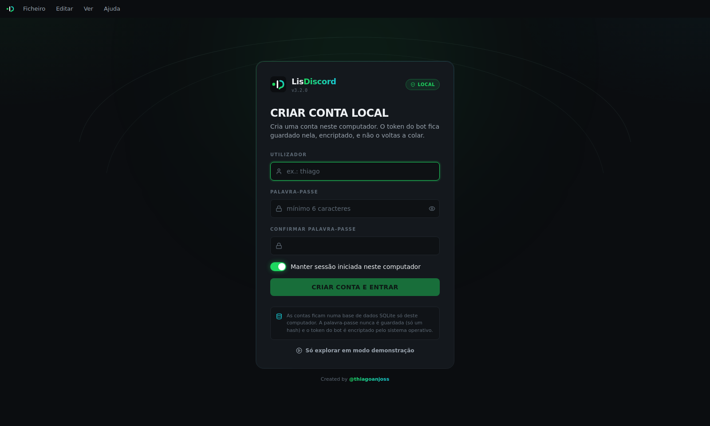<br/><sub>Entrada: conta local ou modo demonstração</sub></td>
    <td>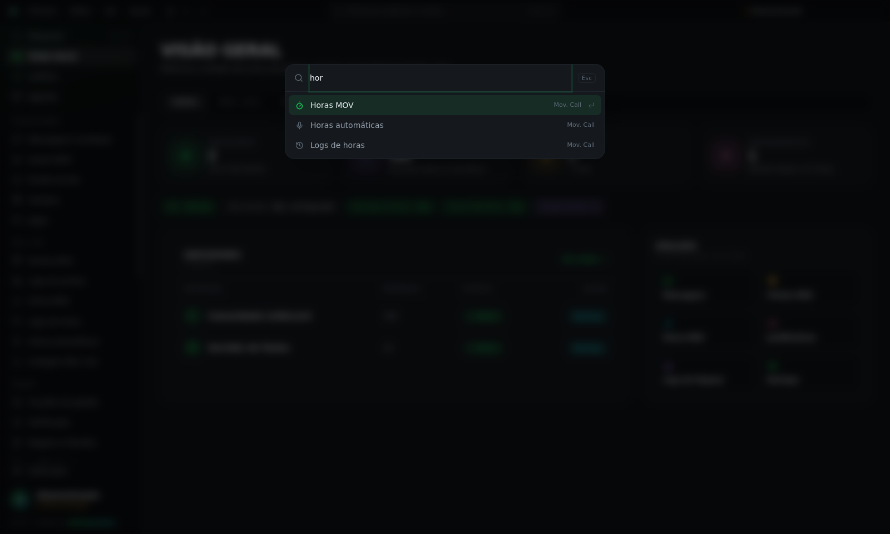<br/><sub>Pesquisa rápida (Ctrl+K)</sub></td>
  </tr>
  <tr>
    <td>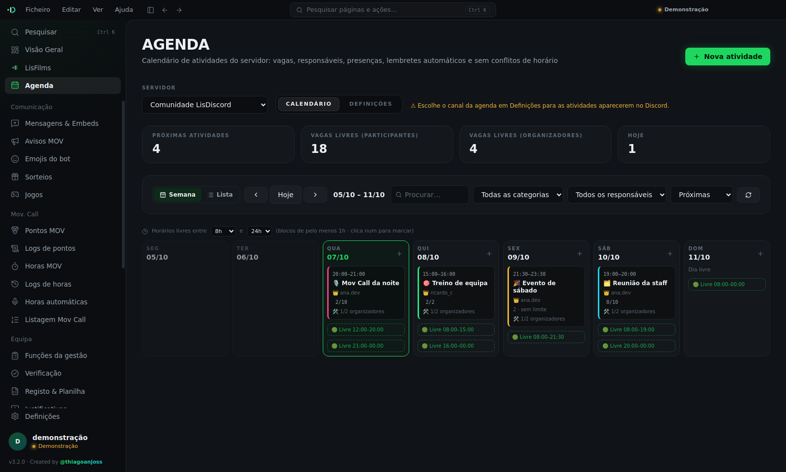<br/><sub>Agenda: semana com horários livres</sub></td>
    <td>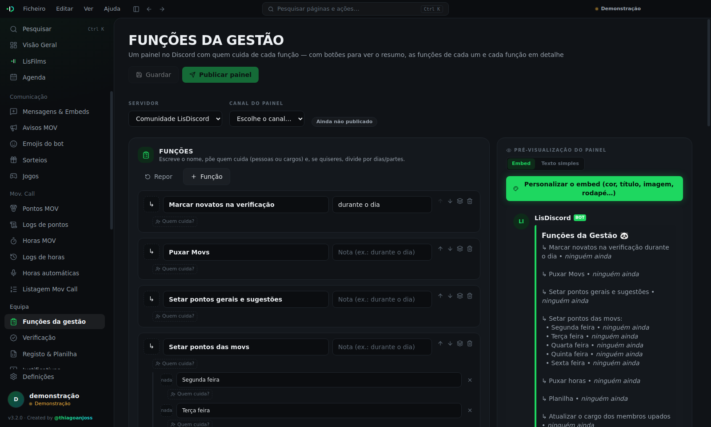<br/><sub>Funções da gestão</sub></td>
  </tr>
  <tr>
    <td>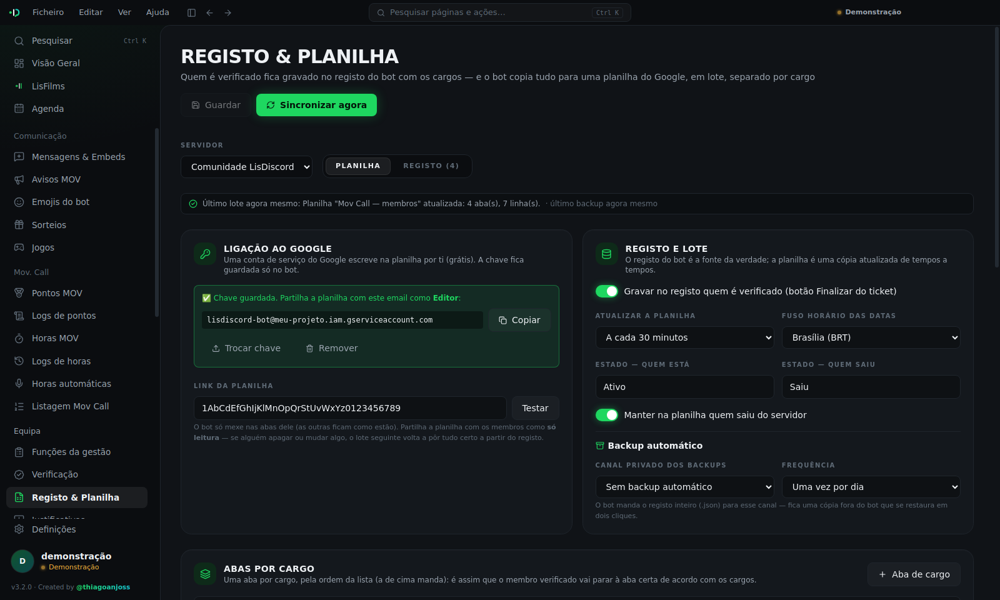<br/><sub>Registo & Planilha (Google Sheets)</sub></td>
    <td>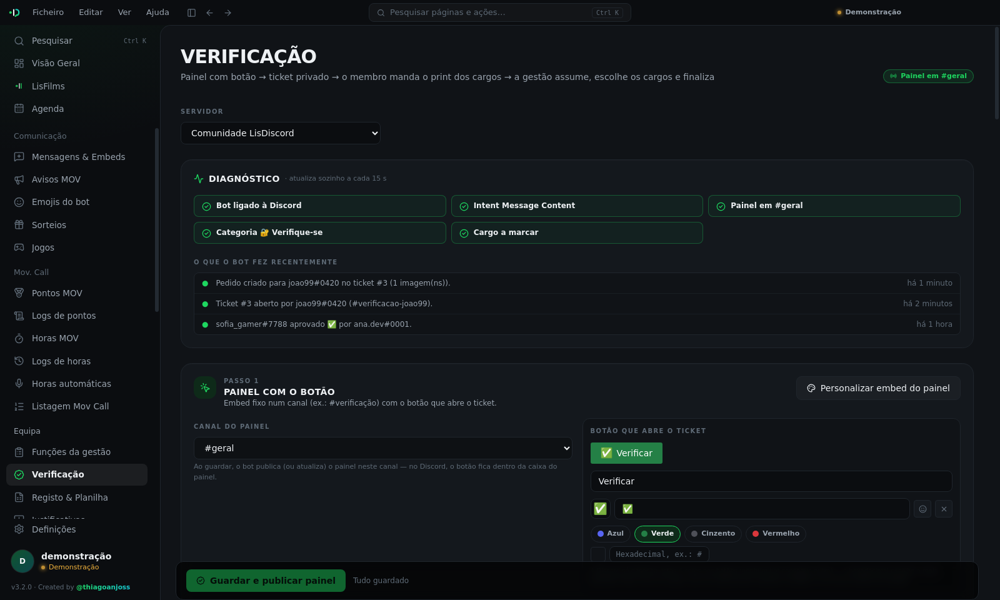<br/><sub>Verificação por ticket</sub></td>
  </tr>
  <tr>
    <td>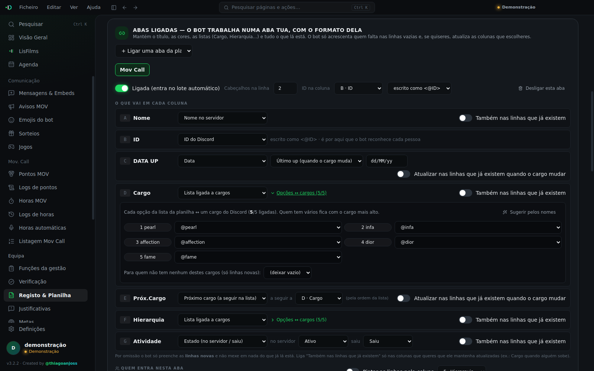<br/><sub>Aba ligada: o que vai em cada coluna e opções ↔ cargos</sub></td>
    <td>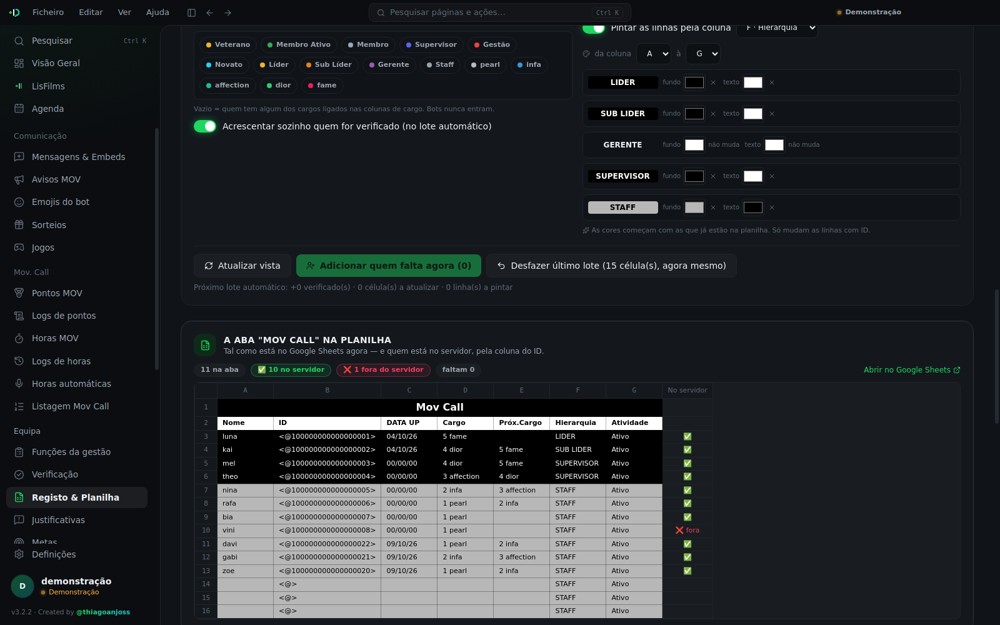<br/><sub>Aba ligada: cores por hierarquia e vista com quem está no servidor</sub></td>
  </tr>
  <tr>
    <td><br/><sub>Moderação: membro aberto</sub></td>
    <td><br/><sub>Sorteios: personalizar</sub></td>
  </tr>
  <tr>
    <td>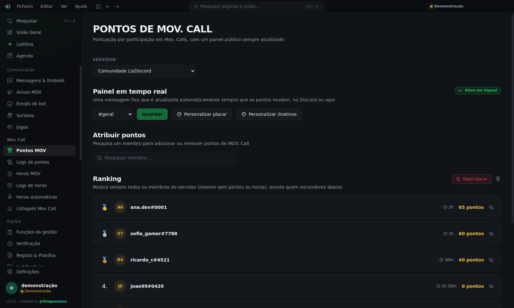<br/><sub>Pontos MOV</sub></td>
    <td>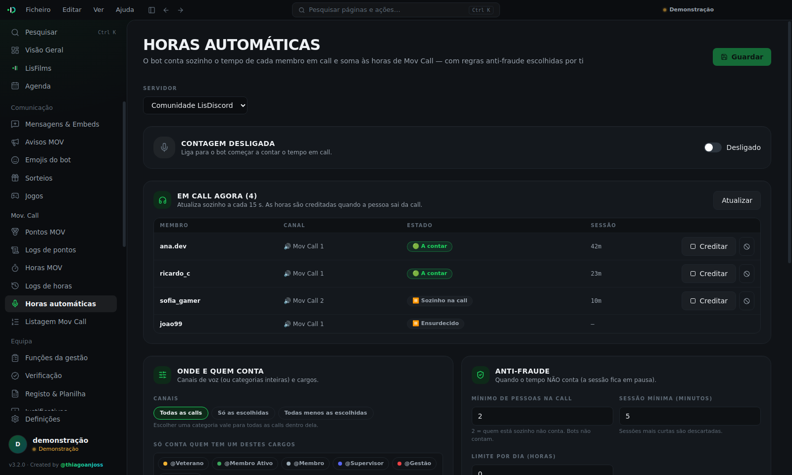<br/><sub>Horas automáticas</sub></td>
  </tr>
  <tr>
    <td>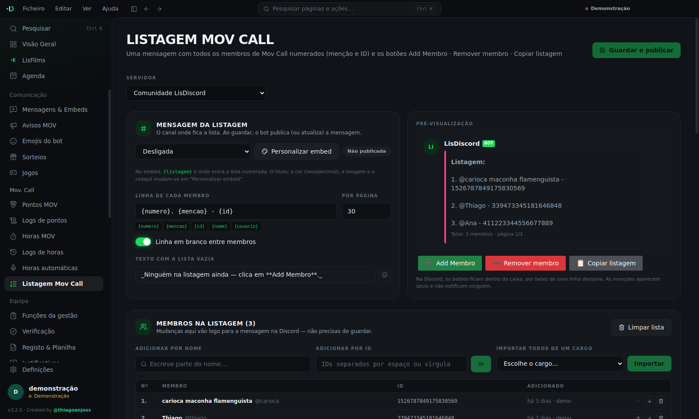<br/><sub>Listagem Mov Call</sub></td>
    <td>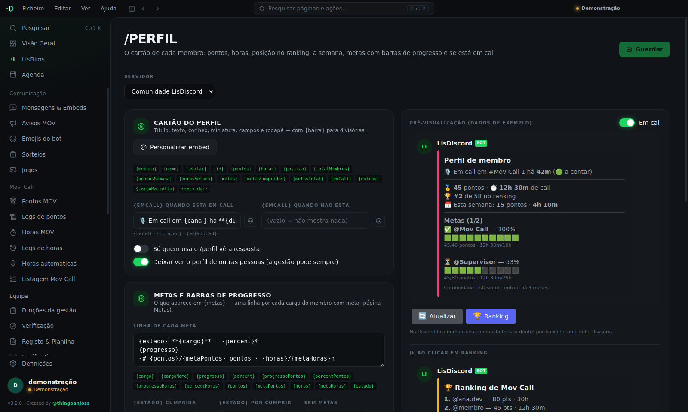<br/><sub>/perfil</sub></td>
  </tr>
  <tr>
    <td>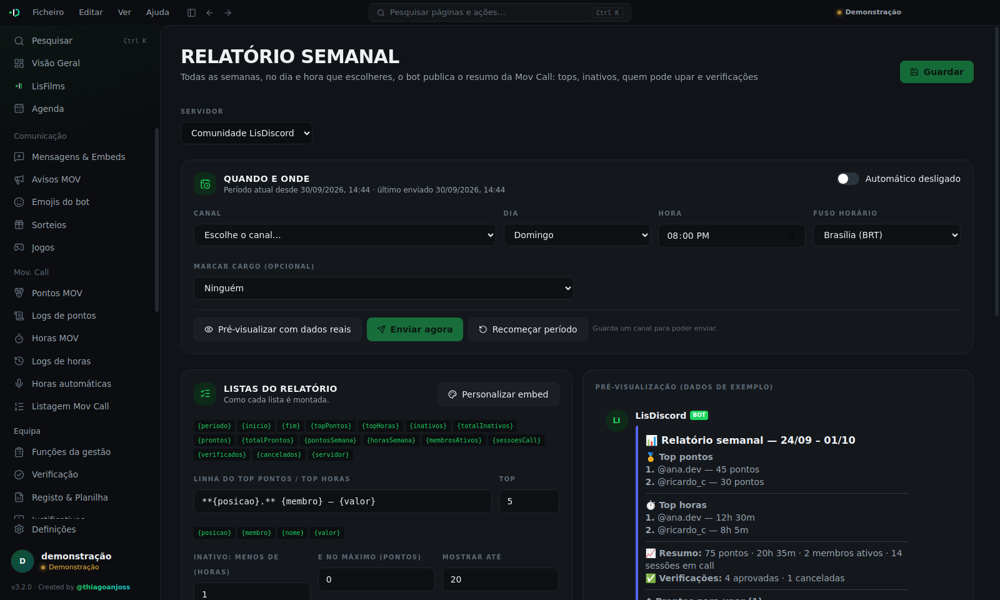<br/><sub>Relatório semanal</sub></td>
    <td><br/><sub>Mensagens & Embeds</sub></td>
  </tr>
  <tr>
    <td>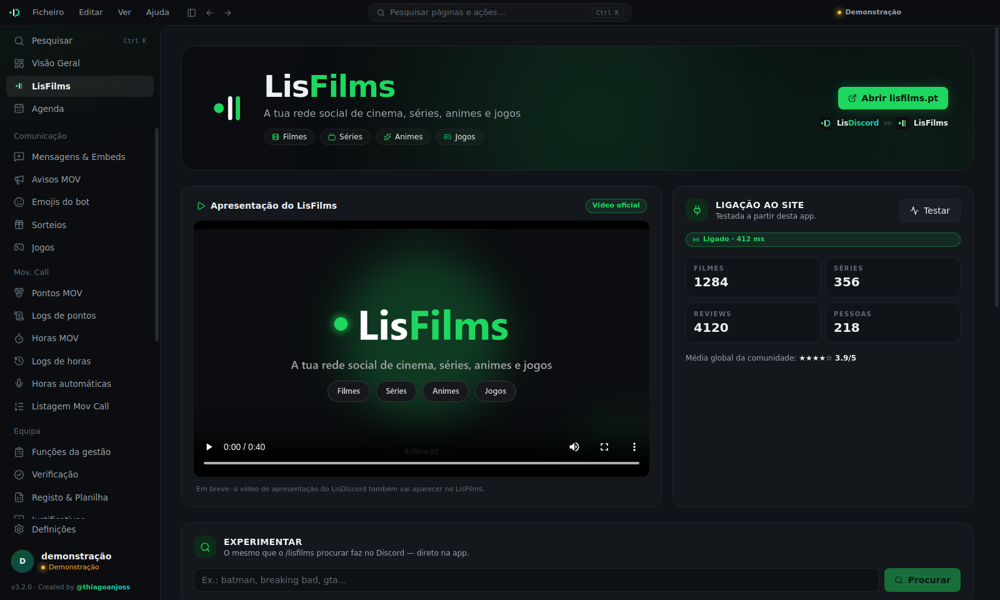<br/><sub>LisFilms</sub></td>
    <td><br/><sub>Jogos</sub></td>
  </tr>
  <tr>
    <td>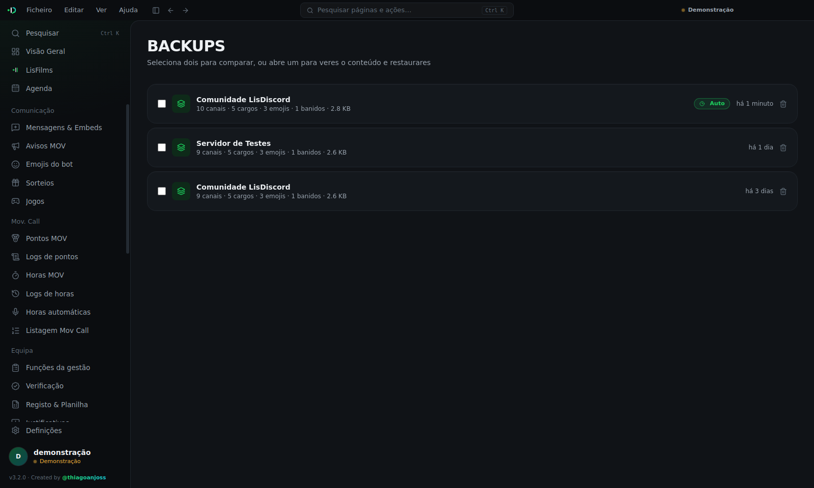<br/><sub>Backups</sub></td>
    <td><br/><sub>Visão Geral</sub></td>
  </tr>
</table>

---

## Configurar com um bot real

1. Cria uma aplicação em [discord.com/developers/applications](https://discord.com/developers/applications) e adiciona-lhe um **Bot**.
2. Em **Bot → Privileged Gateway Intents**, ativa:
   - **Server Members Intent**, para o ranking mostrar toda a gente, para a moderação e para o registo;
   - **Message Content Intent**, para transcripts, logs de mensagens e o print da verificação.
3. Em **OAuth2 → URL Generator**:
   - marca os scopes `bot` e `applications.commands`;
   - marca a permissão `Administrator` (ou só as de que precisas);
   - usa o link gerado para convidar o bot.
4. Na app, cria a conta local e cola o token do bot. O token fica encriptado (via `safeStorage` do Electron) e só é usado para falar com a API da Discord.

Os comandos de gestão aparecem, por omissão, só para quem tem **Gerir servidor**. São eles:

- `/movcall`, `/movhoras`, `/pontosmovadmin`, `/resetmovcall`;
- `/sorteio`, `/embed`, `/avisomov`.

Dá para ajustar isto em **Definições do servidor → Integrações**.

Há exceções com permissões próprias:

- `/limparcdo` exige **Administrador**;
- `/addemoteserver` e `/addsticker` exigem **Gerir expressões**;
- `/atividade` segue os cargos de gestão definidos na Agenda.

Estes ficam abertos a toda a gente:

- `/pontosmov`, `/inativos`, `/verificar`, `/perfil`, `/help`, `/lisfilms`;
- as utilidades e os jogos.

---

## Bot 24/7 e bot remoto

O `server/` é o mesmo bot, sem Electron nem interface, pronto a correr num servidor grátis com Docker. Há dois guias:

- **[Google Cloud Always Free](docs/deploy-gcp.md)**: `e2-micro`, quase sempre disponível na hora.
- **[Oracle Cloud Always Free](docs/deploy-oracle.md)**: máquina maior, mas às vezes sem capacidade.

Com `LISDISCORD_API_KEY` no `.env`, o bot autónomo expõe uma **API remota**. Em **Equipa → Justificativas → Bot remoto** a app liga-se a ela (basta configurar uma vez). A partir daí:

- quase todas as páginas passam a ler e a escrever diretamente no bot que está a correr: pontos, horas, moderação, sorteios, agenda, funções, planilha e o resto;
- a ligação local da app fica **passiva**, para os dois nunca responderem ao mesmo clique.

Para atualizar o bot no servidor:

```bash
cd ~/lisdiscord && git pull && docker compose up -d --build && docker system prune -f
```

---

## Ligar a planilha do Google

É grátis e não precisa de cartão.

1. Em [console.cloud.google.com](https://console.cloud.google.com), cria um projeto e ativa a **Google Sheets API**.
2. Em **IAM e administrador → Contas de serviço**, cria uma conta. Depois vai a **Chaves → Adicionar chave → JSON** e descarrega o ficheiro.
3. Na app, em **Equipa → Registo & Planilha**, carrega esse `.json`.
4. Partilha a planilha com o email da conta de serviço (aparece na app, com botão **Copiar**) como **Editor**.
5. Cola o link da planilha e carrega em **Testar**. A app mostra as abas dessa planilha.
6. Escolhe uma de duas formas (ou as duas):
   - **Abas ligadas**: liga uma aba que já tens (ex.: "Mov Call"). O bot mantém o formato dela e só acrescenta ou atualiza o que escolheres.
   - **Abas do bot (geradas)**: o bot cria e reescreve abas dele (uma com toda a gente e/ou uma por cargo).
7. **Guardar**. Depois **Adicionar quem falta agora** (abas ligadas) ou **Sincronizar agora**.

Sobre a chave e a planilha:

- A chave fica só no bot (`data/google-service-account.json`, com permissões restritas). Nunca volta para a app e nunca vai para o Git.
- Pode ser uma planilha que já tens: o bot só escreve nas abas ligadas e nas que ele próprio criou. Se uma aba tua tiver o mesmo nome e dados, ele não lhe toca e avisa.
- Numa aba ligada o bot nunca limpa nada: escreve só célula a célula, e cada lote dá para desfazer.
- Só entra nas planilhas que partilhares com a conta de serviço.

---

## Scripts

```bash
npm run dev             # app em modo desenvolvimento (Vite + Electron)
npm run lint            # ESLint
npm run build           # build de produção + instalador (electron-builder)
npm run build:unpacked  # build de produção sem instalador
npm run bot             # bot autónomo, sem Electron (precisa de DISCORD_TOKEN)
npm run bot:dev         # o mesmo, a reiniciar quando o código muda
```

Os executáveis para Windows, macOS e Linux são gerados por GitHub Actions a cada tag de versão (`.github/workflows/release.yml`) e publicados em [Releases](https://github.com/thiagodanjos/lisdiscord/releases).

**Tecnologias:**

- [Electron](https://www.electronjs.org/) e [Vite](https://vite.dev/);
- [React 18](https://react.dev/) e [TypeScript](https://www.typescriptlang.org/);
- [discord.js v14](https://discord.js.org/), com Components V2;
- [Tailwind CSS v4](https://tailwindcss.com/);
- [Zustand](https://zustand-demo.pmnd.rs/), [node-cron](https://github.com/node-cron/node-cron) e [sql.js](https://sql.js.org/).

---

## Estrutura do projeto

```
electron/
├── main.ts / preload.ts    # arranque, janela e a ponte segura UI ↔ Node
├── discord/                # tudo o que fala com a Discord
│   ├── client.ts           # ligar o bot, slash commands, encaminhar interações
│   ├── movcall.ts          # pontos, horas, ranking ao vivo, /inativos
│   ├── voiceHours.ts       # horas automáticas em call
│   ├── movList.ts          # listagem de Mov Call
│   ├── activities.ts       # agenda, lembretes, painel
│   ├── activityCover.ts    # dono da mov → supervisores por DM ("Eu assumo")
│   ├── duties.ts           # painel das Funções da gestão
│   ├── verification.ts     # verificação por ticket
│   ├── memberSheet.ts      # registo de membros, lote para a planilha, backups, repor cargos
│   ├── googleSheets.ts     # cliente mínimo da Google Sheets API (conta de serviço, sem bibliotecas)
│   ├── linkedSheet.ts      # abas ligadas: ler a aba, ver quem está no servidor, acrescentar, pintar, desfazer
│   ├── moderation.ts       # moderação completa + sair de servidor
│   ├── giveaways.ts        # sorteios (botão/reação, reroll, lista)
│   ├── giveawayCommand.ts  # assistente /sorteio
│   ├── lisfilms.ts         # /lisfilms
│   ├── backup.ts / restore.ts / diff.ts / transcript.ts
│   ├── games/              # mini-jogos + economia
│   └── …                   # justificativas, avisos, logs, perfil, relatório, utilidades
├── store/                  # dados em JSON (escrita atómica), um ficheiro por área
├── db/schema.sql           # MODELO da base SQLite das contas (sem dados)
├── auth/                   # contas locais, sessões, token por conta
└── ipc/                    # liga a interface às funções acima (local ou bot remoto)

shared/                     # tipos, contrato IPC e lógica comum ao bot e à pré-visualização
src/
├── pages/                  # uma página por rota (Agenda, Funções, Planilha, Moderação…)
├── components/             # AppShell, editores de embed, pré-visualizações
└── lib/                    # bridge (IPC real vs. modo demonstração), navegação
server/
├── index.ts                # bot autónomo (Docker)
└── httpApi.ts              # API remota (LISDISCORD_API_KEY) usada pela app
```

Na raiz, `Dockerfile` e `docker-compose.yml` empacotam o `server/`.

---

## Dados e segurança

**Na app desktop**, tudo fica na pasta de dados da app (**Definições → Abrir pasta**):

- a base de contas `lisdiscord.sqlite`, com o token encriptado;
- backups, registos e configurações em JSON.

**No bot autónomo**:

- os dados ficam em `LISDISCORD_DATA_DIR`; com Docker Compose, é o volume `lisdiscord-data`;
- o token vem só da variável `DISCORD_TOKEN`.

**O que nunca vai para o Git** (está no `.gitignore`):

- `*.sqlite`, `*.db`, `.env`;
- a pasta `data/`;
- `google-service-account*.json`.

O repositório só tem código e o modelo das tabelas.

**O que sai da máquina:** só os pedidos à API da Discord e, se os ativares, à Google Sheets API e à API pública do LisFilms.

**Limites do bot:** usa um bot normal, nunca uma conta de utilizador automatizada. Só faz o que as permissões que lhe deste permitem, e só nos servidores para onde o convidaste.

---

## Autor

**Thiago Souza**: [github.com/thiagodanjos](https://github.com/thiagodanjos) · Created by **@thiagoanjoss**

Os créditos aparecem:

- na app: rodapé, ecrã de entrada e **Definições → Créditos**;
- no rodapé do `/help`;
- no perfil do bot.

## Licença

MIT. Ver [LICENSE](LICENSE).
